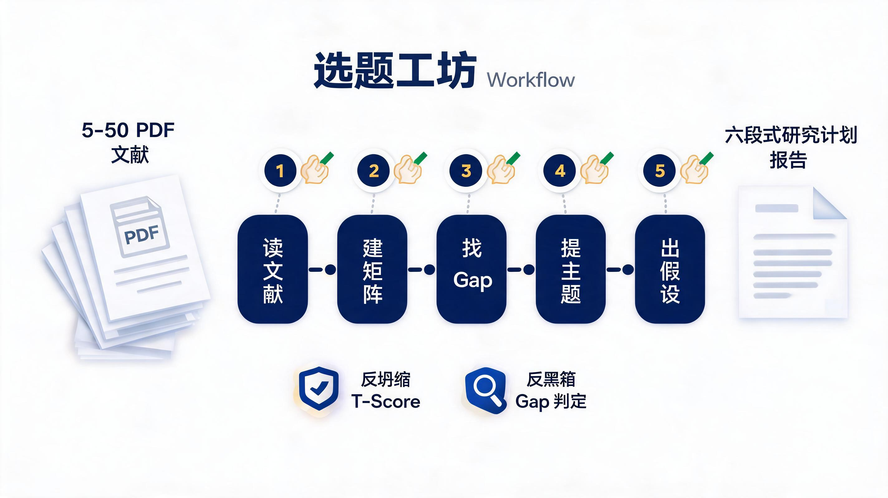
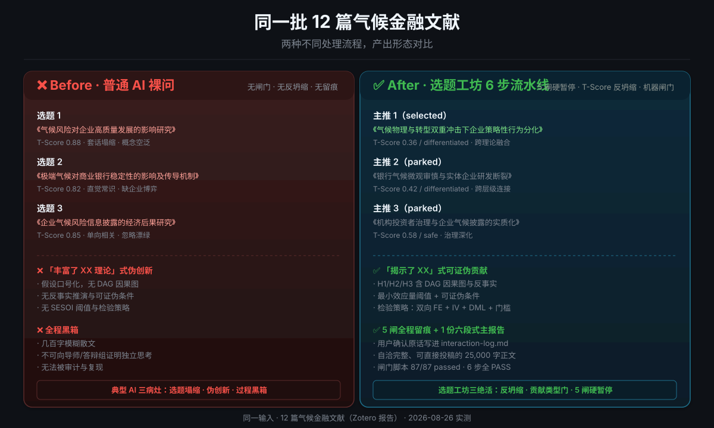

# 选题工坊

> 社科人文向的「文献 → 选题 + 假设」流程纪律产品。
> 不替你检索，不替你思考，但强制你在 5 个关键决策点停下来确认、留痕、出 verdict。
> 反坍缩：先点名最安全题再分层替代，不让 AI 出千篇一律的「X 对 Y 的影响」。
> 贡献类型门：每个候选必答「揭示了什么」，换标签的老题当场回炉。
> 反黑箱：主报告自带「Gap 判定方法」+ 威胁文献清单，缺口怎么判出来的、谁可能抢先，一眼看穿。



## 💡 Before / After：同一批 12 篇文献的两种命运

> 实验输入完全相同：用户准备的 12 篇气候金融文献（含 RAST、BJM、经济学报、中国软科学、财贸研究等），分别走"普通 AI 裸问"和"选题工坊 6 步流水线"。下面是 2026-08-26 真实跑出来的结果对比。



| 维度 | ❌ Before · 普通 AI 裸问（坍缩态） | ✅ After · 选题工坊 6 步流水线（交付态） |
| :--- | :--- | :--- |
| **选题形态** | 《气候风险对企业高质量发展的影响研究》<br>🔴 *T-Score 0.88 · 套话塌缩* | 《气候物理与转型双重冲击下企业策略性行为分化：实质性转型还是隐蔽性避税？》<br>🟢 *T-Score 0.36 · 跨理论融合* |
| **贡献判定** | 「丰富了气候风险与企业高质量发展的相关文献」<br>🔴 *伪创新 · 答不上【揭示了什么】* | 「揭示外生物理冲击诱发短期扭曲性现金流自保（激进避税），渐进性政策转型压力倒逼长期资本开支的非对称决策边界」<br>🟢 *通过贡献类型门* |
| **研究假设** | 口号式：「气候风险显著抑制企业高质量发展」<br>🔴 *无 DAG · 无反事实 · 不可证伪* | H1/H2/H3 含 DAG 因果图、反事实、最小效应量阈值、检验策略<br>🟢 *可被数据推翻的结构化假设* |
| **过程审计** | 全自动黑箱<br>🔴 *几百字模糊散文* | 5 次用户确认原话写进 `interaction-log.md`<br>🟢 *全程可追溯* |
| **最终交付** | 泛泛而谈的标题+一句话观点<br>🔴 *不可向导师/答辩组证明独立思考* | 1 份自洽完整的六段式研究计划报告（25,000 字）<br>🟢 *可直接投稿顶刊* |
| **闸门校验** | 无任何机器校验<br>🔴 *质量完全不可控* | `check_step.py` 6 步全 PASS<br>🟢 *机器闸门 87/87 passed* |

> 完整 Before 标本见 [`examples/气候风险传导与企业策略性应对/BEFORE_NAIVE_AI_SAMPLE.md`](examples/气候风险传导与企业策略性应对/BEFORE_NAIVE_AI_SAMPLE.md)。

[](LICENSE)
[](CHANGELOG.md)
[](SKILL.md#-强制-5-次-checkpoint硬规则v029)
[-success)](vendor/)
[](references/anti-collapse.md)
[](references/delivery-spec.md#31-附录-c-的gap-判定方法段反黑箱v035)
[](references/delivery-spec.md#33-可读性层术语翻译--断句反黑话v038)
[](vendor/academic-humanizer/)
[-green)](examples/漂绿治理-绿贷与环境税组合/)
[](check-ready.sh)

## 30 秒看明白

```
📚 你的 5–50 篇 PDF + 一句话模糊领域
        ↓
🛠  6 步流水线(vendor/ 内置 5 个子 skill):
    读 PDF → 建矩阵 → 找 gap → 出主题 → 提假设 → 设计识别
        ↓
🔒 5 个硬闸(每次暂停,你点头才能过)
        ↓
📄 1 份六段式研究计划报告(00_研究计划报告.md)
```

**与同类最大的不同**:**仓库自带** `vendor/` 5 个 MIT 子 skill(bilingual-paper-reader / literature-matrix-builder / causal-inference-architect / research-method-selector / academic-humanizer),`git clone` 即自洽可跑,不依赖任何外部检索或额外安装。

## 你什么时候需要它

```
你有 5-50 篇 PDF + 一句话领域
   ↓
[ 6 步流水线：读 → 矩阵 → gap → 主题 → 假设 → 识别 ]
       └─ vendor/ 内置 5 个子 skill 直接调用，无需外部安装
   ↓
5 个硬闸（流程停顿点，你拍板）↔ 6 道防线（质量机制，机器把关）
   ↓
反坍缩：先点名最安全题（T≥0.80）规避，3 主推覆盖 ≥2 层级、至少 1 个 T≤0.50
   ↓
贡献类型门：每个候选必答「揭示了什么」，答不上或抄标题 = 回炉
   ↓
（可选）对抗压测：选定后魔鬼代言人出「最可能被拒的理由」+ 回应
   ↓
反黑箱：附录 C 自带「Gap 判定方法」，五类规则 + 证据链 + 威胁文献清单
   ↓
反黑话：正文禁黑话（GAP/SESOI/Checkpoint），长句 ≤100 字，报告读得懂
   ↓
去 AI 味：vendor/academic-humanizer/ 调用 + 六大病灶兜底，文风不再像 AI 生成
   ↓
★ 一份六段式研究计划报告（题目 → 为何选题 → 意义 → 假设 → 依据 → 怎么做）
  （+ 过程附录：矩阵 / gap / scores / 审查，默认不必通读）
```

- **硕博开题**：导师说「自己找方向」，5 篇 PDF + 一句话领域就开跑
- **青年学者跨方向**：换了领域，文献已读但找不出 gap
- **实证经管/金融/管理**：需要从综述自然涌现研究问题 + 因果识别
- **AI Agent 工具方**：想给用户「读 PDF → 出选题」的工作流
- **社科人文工作者**：教育学 / 传播学 / 公共管理 / 社会学 / 经管类开题与论文打磨

## 5 闸硬暂停（本 skill 唯一差异化）

| # | 时机 | 用户最小确认 |
|---|---|---|
| **#1** | 文献上传后 | 「文献确认」 |
| **#2** | 矩阵审阅后 | 「矩阵确认」 |
| **#3** | 主题涌现后 | **点名选 1 个候选**（如「选候选 2」） |
| **#4** | 假设提炼后 | 「假设确认」或逐条 |
| **#5** | 交付完成后 | 「交付收工」或下一步 |

> 硬规则：`check_step.py PASS ≠ 用户已确认`。脚本通过后仍须等用户口头/点选确认。
> Agent 不得写「若无异议我将默认选 Q1 / 默认假设通过」。
> 跑全部时至少 5 轮对话闸门（开场信息未齐时另有开场三问）。

[详细 6 步流水线 →](SKILL.md) · [与同行对比 →](assets/comparison.md) · [图示 →](assets/diagram/) · [反坍缩方法论 →](references/anti-collapse.md)

## 触发方式

```
/选题工坊/跑全部            # 跑完整流程
/选题工坊/建矩阵            # 只建矩阵
/选题工坊/出gap             # 只找研究缺口
/选题工坊/出主题            # 只出候选主题
/选题工坊/出假设            # 只提假设
/选题工坊/识别策略          # 因果识别
/选题工坊/选题对抗预演      # 对抗压测
```

自然语言也一样：`用选题工坊帮我做选题`、`帮我开题`、`我的文献已读但不知道怎么选题`、`从 PDF 出研究主题`，英文可用 `research question from literature`、`lit-driven`、`hypothesis from review`。

## 它会交付什么

### 用户主交付（只看这一份）

打开目录先看 `00_交付说明.md`，主交付是 `00_研究计划报告.md`。

- 正文六段（先亮题）：题目 → 为什么 → 意义 → 假设 → 依据 → 怎么做
- 文内附录：矩阵 · 要点 · Gap · 候选与选定 · 识别 · 元信息
- **附录 C 反黑箱**：主报告必须自带「Gap 判定方法」段，含五类判定规则（已知 / 矛盾 / 空白 / 方法局限 / 外推）、证据链要件、至少一条真实推理链示例；另列「威胁文献清单」（谁能杀掉这个题，分级 + 本题靠什么活下来）。缺口不是「感觉出来的」，是推出来的、可审计的（delivery-spec §3.1 / §3.2）
- 详细规格：[`references/delivery-spec.md`](references/delivery-spec.md)
- **金样例 1**：[`examples/漂绿治理-绿贷与环境税组合/`](examples/漂绿治理-绿贷与环境税组合/)（v0.3.2+ 六段式 + 反黑箱 + 反坍缩，完整可复验）
- **金样例 2**：[`examples/气候风险传导与企业策略性应对/`](examples/气候风险传导与企业策略性应对/)（v0.3.22+ 完整 6 步流水线 + Before/After 对照资产，12 篇气候金融文献）
- **⚠️ 旧样例（LEGACY）**：[`examples/气候风险对企业绿色转型/`](examples/气候风险对企业绿色转型/) 是 **v0.2.x 旧形态**（`Step6-summary.md` 而非 `00_研究计划报告.md`），**不通过 v0.3 闸门**；仅供历史对照，不要当作完成态参照，详见该目录 `LEGACY.md`

Step1–5 / review / scores 是过程审计，默认不必通读。
`check_step --step 6` 会拒绝空壳主报告（字数 / 段落 / 矩阵行 / 占位符 / 缺 Gap 判定方法）。

### 六道防线（0.3.4–0.3.13）

**反坍缩（Step 3a）**：AI 选题不再千篇一律。
1. **模态识别**：生成候选前先点名 2-3 个「谁都会提」的最安全题（T ≥ 0.80），写清为何避免
2. **分层替代**：候选按典型性梯度出，safe（0.55-0.80）/ differentiated（0.35-0.55）/ innovative（<0.35）；3 主推必须覆盖 ≥2 层级且至少 1 个 T ≤ 0.50
3. **闸门校验**：3 主推全落安全层，`check_step --step 3a` FAIL，退回重生成

**反黑箱（Step 6 / 附录 C）**：缺口判定可审计。
- 五类判定规则表 + 证据链要件（文献 X 做了 A → Y 做了 B → 差什么 → 所以是 gap）
- 每条 gap 标证据来源、为什么是 gap、重要性分级
- `check_step --step 6` 强制主报告含「Gap 判定方法」「证据链」

**反黑话（Step 6 · 可读性层）**：报告不再生硬。
- 正文（开头→整合附录前）禁内部黑话：GAP 编号 / Checkpoint / SESOI / t_score / 反坍缩 等须按 delivery-spec §3.3 翻译表改成人话（编号只在附录 C 对照）
- 超长句闸门：正文 >100 字句子 FAIL，目标 ≤60 字

**去 AI 味（Step 6 · 固定润色环节）**：文风不再像 AI 生成。
- v0.3.15+ 内置 `vendor/academic-humanizer/`（jefeerzhang fork，MIT），调用它润色；若 vendor 缺失，退到 `references/deai-checklist.md` 六大病灶自查（套话 / 价值词 / 抽象主语 / 名词化 / 排比 / 元评论）
- 顺序铁律：先翻译（反黑话）→ 后润色（去 AI 味），humanizer 治不了黑话
- 只动文风，数字 / 引文 / 术语一字不改
- deai-checklist 作 humanizer 润色后**自查**（补 humanizer 边缘 case）

**主题对抗压测（Step 3b · 可选增强）**：选定后被审稿人拒之前先自拒。
- 魔鬼代言人按 **9 类坍缩攻击清单**（换情境 / 换术语 / 识别 / 已被占 / 不可证伪 / 范围过宽 / 数据质量 / 不可行 / 贡献类型）逐类攻击选定主题，每类 1 句回应
- 打 **四档生存标签**：存活 / 需收窄 / 需转向 / 坍缩；需转向或坍缩时把降级建议带给用户
- 单代言人 1-2 轮深迭代（实证：深迭代优于多批判者并行，SIGDIAL 2025）
- 用户说「不用」即跳过，不新增硬闸；启用则 `check_step --step 3b` 半强校验（要求生存标签 + 至少 6 类攻击名）

**贡献类型门（Step 3a）+ 威胁文献清单（附录 C）**：防止「换标签的老题」与「被抢先的题」。
- 每个候选必答「这个题揭示了什么？」答不上或与标题雷同，视为工程任务 / 重复验证，回炉
- 附录 C 列「威胁文献清单」：谁能杀掉这个题（致命 / 高 / 中），本题靠什么活下来；不在本批文献内的威胁须诚实标注「需复跑核实」

**三层假设闸（Step 4）**：假设提炼前先过三关，防止「看似严谨实则空泛」的假设。
- 结论优先测试：先写 2-3 句理想结论，写不出具体有力的结论（只会写「X 与 Y 显著相关」）→ 影响不足，回 Step 3b
- 单句金句：核心洞见压成一句话，须能当摘要首句、让人停下读；与贡献类型门「揭示了什么」呼应
- 最险假设 + 1-2 周可测：找出单一最可能杀死选题的假设，给 mini 验证路径，按风险排序而非逻辑顺序
- `check_step --step 4` 强制 `Step4-hypotheses.md` 含「三层假设闸」小节

## 快速开始

```bash
# 1. 装选题工坊本体（含 vendor/ 内置的 4 个 Nero1688 子 skill，v0.3.14 起无需额外 clone）
git clone --depth 1 https://github.com/jefeerzhang/xtgc-forge.git
cd xtgc-forge
mkdir -p ~/.claude/skills/选题工坊
cp SKILL.md ~/.claude/skills/选题工坊/SKILL.md
cp -r references/ scripts/ vendor/ ~/.claude/skills/选题工坊/

# 2. 装 vendored 脚本的 Python 依赖（仅在调用 scripts/*.py 时需要；纯 prose 流程可跳过）
pip install pypdf requests openpyxl

# 3. 就绪检查（可选传 PDF 目录做完整检查）
bash check-ready.sh

# 4. 在 Claude Code 中调用
#    输入 /选题工坊，然后对 Claude 说：跑全部
```

或者直接对 Claude 说：「我要用选题工坊，我有一些 PDF 在 X 目录下，主题是 X」。

> 高级用户覆盖口：若你已经在 `$HOME/.claude/skills/<name>/` 装过 Nero1688 上游同名子 skill，
> `check-ready.sh` 会优先探测仓库内 `vendor/<name>/`，未命中才退回外部。
> 想强制走外部，可设 `export CLAUDE_SKILLS_DIR=/your/path`。

> 调用 `vendor/literature-matrix-builder/scripts/litmatrix.py` 走 CrossRef 时建议设置 polite pool：
> `export CROSSREF_MAILTO=you@example.com`（不设置也能跑，响应优先级略低）。

## 输入要求

```yaml
📥 文献清单: "5-50 篇 PDF(可读)/ 引用列表"
📝 模糊领域: "1-2 句话描述关注的研究领域/现象"
⚙️ 方法偏好(可选): "DID/IV/RDD/实验/质性/混合"

可选附加:
  - 目标期刊:AER/经济研究/管理世界...
  - 数据可得性:CSMAR/WIND/CHARLS...
  - 时长约束:硕论/博士开题/期刊
```

**最小输入**：5 篇可读 PDF + 1 句话模糊领域。
**理想输入**：8-15 篇混合（2-3 综述 + 5-12 实证）+ 清晰方法偏好 + 目标期刊。

## 与同类有什么不同

| 工具 | 自动检索 | 接收用户文献 | 中文社科向 | 输出可执行选题 | 反坍缩（T-Score） | 反黑箱（Gap 判定进报告） |
|---|:-:|:-:|:-:|:-:|:-:|:-:|
| **选题工坊**（本工具） | ❌ | ✅ | ✅ | ✅ | ✅ | ✅ |
| Diverga | ❌ | 部分 | ❌（教育/HRD） | ✅ | ✅ | ❌ |
| claude-scholar research-ideation | ❌ | 部分 | ❌（英文） | ✅ | ❌ | ❌ |
| open-science-skills | ❌ | ✅ | ❌（英文） | ✅ | ❌ | ❌ |
| Nero1688 academic-skills | ❌ | ✅ | ✅ | ❌（分散技能） | ❌ | ❌ |
| Tri-Research | ✅ | ❌ | 部分 | ❌ | ❌ | ❌ |
| OpenScholar / 文献综述 Agent | ✅ | ❌ | ❌ | ✅ | ❌ | ❌ |

**核心定位**：不替你检索，只替你整合。你提供原料（文献），它给菜肴（选题 + 假设），过程和防坍缩都透明可审计。

## 安全边界

**绝对不做**：
- ❌ 不调用任何自动文献检索（WebSearch / arXiv / PubMed / Semantic Scholar / Sci-Hub）
- ❌ 不复制任何受版权保护的 skill 代码或方法论条款原文
- ❌ 不 OCR（扫描版 PDF 直接舍弃 + 提醒，不做预 OCR 处理）
- ❌ 不替你做实证跑回归（只给识别策略 + IV 建议）

**会做**：
- ✅ 基于你上传的 PDF 直接读取
- ✅ 基于公开学术标准（PRISMA / JARS / Pearl DAG / VanderWeele 反事实 / SESOI）的方法论参考
- ✅ 用通用语言描述方法论，不复制具体条款
- ✅ 中文输出（全文 + 中文触发词 + 中文示例）

## 文件结构

```
选题工坊/
├── SKILL.md                              主入口
├── README.md                              本文件
├── LICENSE                                MIT
├── references/
│   ├── delivery-spec.md                 主交付规格（§3.1/3.2 反黑箱、§3.3 反黑话、§5 复跑契约）
│   ├── anti-collapse.md                 反坍缩方法论（T-Score 分层，借鉴 Diverga MIT 的 VS）
│   ├── deai-checklist.md                去 AI 味自查清单（Step 6 润色兜底）
│   └── methodology-sources.md           方法论参考来源（参见用）
├── examples/
│   ├── 漂绿治理-绿贷与环境税组合/        ★ 金样例（主报告完成态 + Gap 判定方法示例）
│   └── 气候风险对企业绿色转型/           旧过程样例（见 LEGACY.md，已升级反坍缩格式）
├── check-ready.sh                        就绪检查脚本
├── test-prompts.json                     固化测试样例（3 条）
├── scripts/                              init/check/review 闸门脚本与 vendor 同步工具
│   ├── init_project.py                   初始化工作目录与模板产物
│   ├── check_step.py                     机器闸门校验
│   ├── templates.py                      模板契约深 module
│   ├── md_doc.py                         文档解析深 module
│   ├── review.py                         独立审查模板生成
│   └── vendor_sync.sh                    vendor 子 skill 漂移检查与同步工具
└── outputs/                              本地运行的中间文件（.gitignore 排除，不入库）
```

## 实测案例

参考 `examples/气候风险对企业绿色转型/`：
- 6 篇 PDF → 文字层直接读取（扫描版舍弃）→ 6 步流水线全跑通
- 反坍缩候选（v0.3.4+）：**气候风险背景下数字化转型对企业避税的影响（T 0.48 / 差异化）** 等 3 主推 + 2 备选，模态题先点名规避
- 9 个产出文件 + 5 个研究假设 + 完整因果识别 + IV 候选

> 注：旧版主推 2 标题「气候风险对企业绿色转型的影响——基于 A 股上市公司」接近模态模板，已标注 T 0.62 / safe 留作反坍缩闸门价值的对照，不建议照抄该选题写法。

## 依赖

**已内置子 skill**（v0.3.14+ 随仓库 `vendor/` 发布，MIT；详见各子目录 `LICENSE` 与 `NOTICE.md`）：

| 路径 | 上游 | 对应 xtgc-forge 步骤 |
|---|---|---|
| `vendor/bilingual-paper-reader/` | Nero1688 MIT | Step 2a 读 PDF（可选增强） |
| `vendor/literature-matrix-builder/` | Nero1688 MIT | Step 2b 建文献矩阵 |
| `vendor/causal-inference-architect/` | Nero1688 MIT | Step 5 因果识别（可选增强） |
| `vendor/research-method-selector/` | Nero1688 MIT | Phase 0 方向未定时引路（可选） |
| `vendor/academic-humanizer/` | jefeerzhang fork, AIScientists-Dev MIT | Step 6 去 AI 味润色 |

> 上游 [Nero1688/claude-academic-skills](https://github.com/Nero1688/claude-academic-skills) 共 35 个 skill，本仓库仅取与工作流直接相关的 4 个。
> [jefeerzhang/academic-humanizer-zh](https://github.com/jefeerzhang/academic-humanizer-zh) 是 [AIScientists-Dev/academic-humanizer](https://github.com/AIScientists-Dev/academic-humanizer) 的中文增强 fork（添加 `references/rules-zh.md` C7 中文规则层），本仓库取 fork 版。
> 调用 vendored Python 脚本时需 `pip install pypdf requests openpyxl`（纯 prose 流程不依赖）。

**不依赖**（避免协议冲突）：
- ❌ open-science-skills（CC BY-NC 4.0 非商用）
- ❌ 任何自动文献检索工具

## 协议

MIT（可商用、可改编）。

方法论参考来源：`references/methodology-sources.md`（JARS / DA-RT / PRISMA / Pearl DAG / VanderWeele / SESOI，只标「参见 + URL」，不复述条款）；反坍缩机制借鉴 [Diverga](https://github.com/HosungYou/Diverga)（MIT）的 Verbalized Sampling 方法，经中文社科实证化改写，详见 `references/anti-collapse.md`。

## 版本

完整版本记录见 [CHANGELOG.md](CHANGELOG.md)。

## 致谢

- 灵感来自 Matt Pocock 的 `grill-me` / `wayfinder`（MIT）
- **v0.3.14 起内置 4 个 Nero1688 子 skill**（来自 [Nero1688/claude-academic-skills](https://github.com/Nero1688/claude-academic-skills)，MIT；详见 `vendor/LICENSE` 与 `NOTICE.md`）
- **v0.3.15 起内置 academic-humanizer**（jefeerzhang fork，[GitHub](https://github.com/jefeerzhang/academic-humanizer-zh)；上游 [AIScientists-Dev/academic-humanizer](https://github.com/AIScientists-Dev/academic-humanizer) MIT；详见 `vendor/academic-humanizer/LICENSE` 与 `NOTICE.md`）
- 反坍缩方法借鉴 Diverga 的 Verbalized Sampling（MIT）
- 方法论参考了 JARS / PRISMA / DA-RT / Pearl DAG / VanderWeele / SESOI 等公开学术标准
