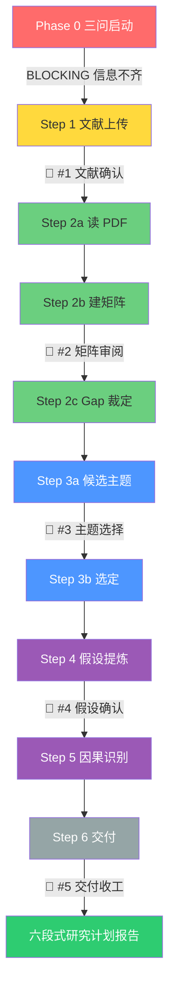

# 选题工坊 v0.3.18

## 📊 流水线一览(图)



> 详见 [`assets/diagram/pipeline.mermaid`](assets/diagram/pipeline.mermaid) 源文件。

## 启动说明(新任务首次响应必须发送)

每次用户首次调用本技能时,先向用户说明以下内容(可调整排版,但不得省略流程与多轮交互提示):

```markdown
本选题工坊是"基于用户文献的可审计选题流程",**以你自己准备的文献为唯一出发点**,不会自动检索文献。

使用流程:
1. 明确你的研究兴趣、当前阶段、研究基础和交付目标(三问启动);
2. 上传你已准备的 PDF / 文献清单;
3. 我会读取你的文献,提炼要点、建矩阵、识别 gap;
4. 从 gap 涌现 3-5 个候选主题,你选 1 个;
5. 我提炼 3-5 个研究假设,你确认;
6. 如需,我给因果识别策略;
7. **交付 1 份自洽完整的研究计划报告**(主产品=正文六段+文内矩阵/Gap 等附录);Step1–5 为过程留痕。

最终报告:
- 正文顺序(先亮题):题目 → 为什么 → 意义 → 假设 → 假设依据 → 怎么做
- 文内必须整合:文献矩阵、要点、Gap、候选与选定、识别要点
- 论述须充分(文献/理论/推理),禁止一句话观点或只贴表不论证

本技能**强制 5 次 Checkpoint 硬暂停**(文献确认 → 矩阵审阅 → 主题选择 → 假设确认 → 最终交付),不得跳过、不得代用户自动确认。
另有 Phase 0 三问(信息未齐时 BLOCKING)。请提前准备 PDF / 文献条目(5-50 篇)。
```

发送启动说明后,在同一条回复中继续问**三问启动**(Phase 0)。

---

## 核心理念

**主题不是"想出来"的,是"看出来"的**。
本 skill 强制按 6 步走:**用户上传文献 → 文献综述 → 涌现主题 → 提炼假设 → 因果识别 → 交付**。
每一步都建立在前一步的产出上,禁止跳步。

---

## 最终产品规格(全局纪律 · 必读)

**完成态**:用户只打开 `00_研究计划报告.md` 即可带走选题(正文六段 + 文内矩阵/要点/Gap/候选/识别)。过程文件仅审计。

| 必读 | 说明 |
|---|---|
| ★ `00_研究计划报告.md` | 唯一面向用户的完成态 |
| `00_交付说明.md` | 打开目录时的入口(init 生成) |
| 详细规格 | [`references/delivery-spec.md`](references/delivery-spec.md)(字数/附录/复跑/分档**只在此维护**) |
| 金样例 | [`examples/漂绿治理-绿贷与环境税组合/`](examples/漂绿治理-绿贷与环境税组合/) |

**正文顺序(先亮题)**:题目 → 为什么 → 意义 → 假设 → 假设依据 → 怎么做。  
**硬规则摘要**:充分论述(禁止一句话);附录 A 矩阵不可用「详见 Step2b」代替;`check_step --step 6` 校验字数/段落/矩阵行/占位符。  
**复跑**:仅当用户明确沿用 + 存在 `00_复跑决策记录.md` 且文献/收窄未变;否则仍 5 闸(见 delivery-spec §5)。**复跑模式:5 闸全部仍须各停一次(L399 硬规则优先)。**

**复跑纪律(v0.3.10)**:①**附录 F 决策表不是当次授权**——它是历史记录;复跑授权必须由 `00_复跑决策记录.md`(含用户当次原话 + 时间)提供;②`check_step --step 6` 校验:声明复跑却无复跑记录 / 复跑记录是空壳(占位符、无原话、无时间)→ FAIL;③复跑 ≠ 无留痕:interaction-log 仍须 5 闸各一条确认(状态标「已确认·复跑授权」)。

> **字面 token 声明**:token = `已确认 · 复跑授权`(全角空格、中间为中点 `·`)。匹配正则:`r"已确认\s*·\s*复跑授权"`(允许两端任意空白)。其它写法(如「已确认复跑授权」「确认复跑」「复跑通过」)均不算。

### 交互留痕(v0.3.9 · 5 闸的证据,硬规则)

**5 次 Checkpoint 每次暂停/确认,必须写 `interaction-log.md`**(每闸一行,含用户原话)。规则:

**「明确确认」** = 用户原话含「确认」/「通过」/「选 X」/「OK」/「同意」之一;「继续」「好的」「嗯」不算。

1. **先写日志,再进下一步**——每次闸门暂停、用户确认后,立即追加一行 `| 闸门 | 已确认 | 时间 | 用户原话 |`,禁止拖到结尾补记
2. **只记用户实际说过的原话**,禁止代填、禁止写「用户无异议」;占位符(< > / 待填)不算确认
3. **没有本文件 / 缺任一闸确认 = 未交互**:`check_step --step 6` 与 `--step all` 直接 FAIL,禁止交付
4. 子模块模式(只跑「出主题」等)至少留所跑闸门的记录;「跑全部」必须 5 闸齐全

---

## 三问启动(Phase 0,BLOCKING)

调用 `research-method-selector` 子 skill 推断 branch(推断性 / 描述性 / 质性 / 混合)。

**不要直接进入文献处理**。在读取用户 PDF 之前,先问 3 个问题:

1. **你在关心什么问题?** — 1-2 句话描述研究兴趣 / 现象 / 直觉
2. **为什么是现在?** — 时间约束(硕论 / 博士开题 / 期刊投稿)+ 这个方向是否来得及
3. **你已有什么材料或基础?** — 文献数量 + 是否含综述 + 数据可得性 + 方法偏好

### 三问的推荐问法(可任选一种)

**方式 A · 一次性发问(推荐)**:
```
在开始处理文献之前,先问 3 个问题(每个 1-2 句话即可):

1. 你在关心什么问题?(研究方向 / 现象 / 直觉)
2. 为什么是现在?(时间约束,什么时候要交?)
3. 你已有什么材料?(几篇 PDF?含综述吗?数据可得?)

回答后我开始读你的文献。
```

**方式 B · Grill 机制(分次问)**:
如果用户输入很薄,用分次追问法:一次只问 1 个,等用户回答后再问下一个。每个问题附推荐答案。**注:Grill = 闸门内的子问;与 Phase 0 分次问法(一次只问 1 个)不同。**

### 输入过薄的处置

**输入过薄阈值**:≥ 1 完整子句(≥ 8 字)+ ≥ 1 个研究对象(如 ESG / 碳排放 / 绿色金融);不达标则停在 Phase 0。

若用户拒绝回答或输入过薄,**停在 Phase 0,不硬编**。告诉用户:
"需要至少 1 句话的'关心的问题'才能启动。你可以简单说:我在研究 X 方向,想找 Y 类的题目。"

### Phase 0 完成后才进入 Phase 1(文献准备与输入确认)

三问通过后,把用户回答保存为 `00_任务元信息.md`(学科背景 / 当前阶段 / 时间约束 / 交付目标),然后才进入 SKILL.md 的 Step 1。

如果用户已经提供了部分信息(比如模糊领域),跳过三问直接进入 Step 1,但在 Step 1 开头说明"我看到你已提供 X,还需要 Y 才能继续"。

---

## 🎯 使用前必读(用户必做清单)

调用本 skill 前,**用户必须先做 3 件事**:

1. **📥 上传文献**(最重要!)- 把你要研究领域的 PDF 文件(或引用列表)准备好
   - 数量:5-50 篇(太少不够覆盖,太多跑不动)
   - 形式:有 PDF 最佳,纯引用列表也可(质量降一档)
   - 字段:作者、年份、标题、期刊(必备);DOI(强烈建议)
2. **📝 写一句话的模糊领域** — 1-2 句话描述你想研究什么
3. **⚙️ 选方法偏好(可选)** — 你倾向 DID/IV/RDD/实验/质性/混合等

**如果你还没准备好文献**:
- 提示用户先去读 5-10 篇近 3 年的综述(从 CNKI / Google Scholar / Scopus / SSRN 检索)
- 或者直接告诉 skill 你的模糊领域,让 skill 引导你去找文献的方向(但 skill 不会自动检索,只会给"关键词检索式"建议)

---

## 输入契约

调用本 skill 时,用户必须提供:

```yaml
📥 文献清单: "用户自备的 5-50 篇文献"
   - 形式:PDF 文件(有)/ 引用列表(无 PDF 也可)
   - 每条至少含:作者、年份、标题、期刊
   - 强烈建议包含 2-3 篇最近 2 年的综述/meta-analysis
📝 模糊领域: "1-2 句话描述关注的研究领域/现象/直觉"
⚙️ 方法偏好(可选): "用户倾向的识别策略(DID/IV/RDD/实验/质性/混合)"

可选附加:
  - 目标期刊:"AER/QJE/经济研究/管理世界/Social Forces ..."
  - 数据可得性提示:"已掌握 CSMAR/WIND/CHARLS ..."
  - 时长约束:"硕士论文 / 博士开题 / 期刊投稿"
```

**绝对禁止**:本 skill 不得调用任何自动文献检索工具。所有分析必须基于上述输入。

---

## 命令入口(模块化)

Claude Code 的 skill 只有一个 slash 入口:`/选题工坊`。进入后用**自然语言子命令**驱动各模块。

### 默认入口:全流程

```
/选题工坊
然后对 Claude 说:跑全部
```

**入口行为**:
1. **第一件事**:问用户"你的文献准备好了吗?"
   - 如果**没准备好**:给出准备指引(参见 SKILL.md 顶部"使用前必读"),**不进入流水线**
   - 如果**准备好了**:继续
2. 让用户上传文献(PDF 或引用列表)
3. 让用户写模糊领域 + (可选)方法偏好
4. 从 Step 1 一路跑到 Step 6,**强制在 5 个 Checkpoint 各暂停一次**,等用户明确确认后再继续(见下节「强制 5 次 Checkpoint」)

### 子模块独立调用(高级用户)

进入 `/选题工坊` 后,对 Claude 说以下任一说法:

| 说法 | 对应步骤 | 作用 |
|---|---|---|
| "读文献" | Step 2a | PDF 提要点(无 PDF 跳过)|
| "建矩阵" | Step 2b | 结构化文献矩阵 |
| "出gap" | Step 2c | gap 裁定 |
| "出主题" | Step 3 | 涌现候选主题 + 用户选 |
| "出假设" | Step 4 | 提炼研究假设 + 用户确认 |
| "识别策略" | Step 5 | 因果识别(自动检测研究类型后启用/跳过)|

子模块默认读取工作目录里的中间产出文件。如果中间文件不存在,提示用户先跑前置模块。

---

## 6 步流水线

```
Step 1 · 文献准备与输入确认  ← 用户第一个动作是上传文献!
       ↓ 🛑 Checkpoint #1(文献确认) → scripts/check_step.py --step 1
Step 2 · 文献综述       读 + 建矩阵 + 出 gap(3 子步)
       ↓ 🛑 Checkpoint #2(矩阵审阅) → scripts/check_step.py --step 2b
Step 3 · 涌现主题       从 gap 出 3 主推 + 2 备选 → 用户选 1
       ↓ 🛑 Checkpoint #3(主题选择 + Grill 追问) → check_step.py --step 3a
Step 4 · 提炼假设       DAG + 反事实 + 效应量 → 用户确认
       ↓ 🛑 Checkpoint #4(假设确认 + Grill 追问) → check_step.py --step 4
Step 5 · 因果识别       自动检测研究类型,推断性研究才启用
Step 6 · 用户主交付     六段式研究计划报告(过程文件降级为附录)
       ↓ 🛑 Checkpoint #5(最终交付审阅) → check_step.py --step 6
```

## 🎯 Step 3a 输出格式:3 主推 + 2 备选 + topic_scores.json

**3 主推**:从 gap 派生的高价值选题,每个含:
- 来源 Gap
- 研究问题(RQ)
- 理论贡献
- **揭示了什么(贡献类型门,v0.3.7)**
- 方法可行性
- 预期效应方向
- **研究类型标签**(推断性 / 描述性 / 质性)
- **降级条件**(什么情况下退到备选)
- **T-Score(0-1)+ 层级 tier**(safe / differentiated / innovative):inline 启发式:0.81–1.0 safe(已知区主效应);0.51–0.80 differentiated(有方向但需机制);≤0.50 innovative(新机制或边界探索)。同期展开字段:`t_score` in topic_scores.json / Gap-C1 = Step 2c 五类 Gap 第 1 类「已知区」/ Checkpoint #N = 5 闸强制暂停第 N 闸。详见「反坍缩机制」。

**2 备选**:降级场景的备选,每个含:
- 来源 Gap
- 研究问题(RQ)
- 理论贡献
- **揭示了什么(贡献类型门,v0.3.7)**
- 降级场景(主推不可行时启动)
- 研究类型标签
- **T-Score(0-1)+ 层级 tier**(同上)

**topic_scores.json** — 6 维评分(RTS(Research Topic Skills)风格)+ 反坍缩字段:

| 维度 | 含义 |
|---|---|
| **importance** | 理论 + 实践价值(1-5) |
| **feasibility** | 数据 + 方法可获取性(1-5) |
| **falsifiability** | 能否被推翻(1-5) |
| **evidence_leverage** | 现有文献能支撑多少(1-5) |
| **originality** | 与已有研究的差异度(1-5) |
| **negative_value** | 被推翻后学界仍感兴趣(1-5) |
| **t_score** | 典型性评分 0-1(越高越「谁都会这么想」,反坍缩用,见 `references/anti-collapse.md`) |
| **tier** | 层级:safe / differentiated / innovative(由 t_score 推导) |

每个 candidate 的 `decision` 字段:`selected`(主推)/ `parked`(备选)/ `dropped`(淘汰)。`dropped` 必须填 `kill_rule`。

**用户决策建议**:参考 topic_scores.json 的 total 分数,但用户必须**显式点名**(如"选候选 2"),**不得默认选最高**;若主推不可行,降级备选须用户确认并说明原因(参见 L455)。

> 交叉引用:Checkpoint #3 (L455) 明确规定「禁止默认选 total 最高项」,本建议与该硬规则对齐。

**生成方式**:由 `scripts/init_project.py` 创建空模板,skill 跑 Step 3a 时填入 6 维评分。

## 🎯 反坍缩机制(v0.3.4,Step 3a 强制)

**问题**:AI 选题会「坍缩」——无论给什么 gap,都收敛到「X 对 Y 的影响——基于 A 股上市公司」这类最安全、最可预测的题目。**防法:先点名最安全题,再主动向低典型性方向采样。**

完整方法论:`references/anti-collapse.md`。借鉴 Diverga(MIT)的 VS(Verbalized Sampling)方法,已中文社科实证化。**执行三阶段**:

### Phase 1 · 模态识别(必做)

生成候选**之前**,先在 Step3a 文件顶部列 2-3 个「任何人看到这些 gap 都会提」的最安全题,标 T ≥ 0.80,写清避免理由:

```markdown
## 模态识别(反坍缩 Phase 1)
| 模态题(示例) | T-Score | 避免理由 |
|---|---|---|
| 绿色信贷对企业漂绿的影响——基于 A 股上市公司 | 0.90 | 已知区主效应,无新信息 |
| 企业漂绿与融资成本的关系研究 | 0.85 | 无方向、无机制 |
```
> 不点名,坍缩就不可见。此步保证「避开了什么」可审计。

### Phase 2 · 分层替代

候选按典型性梯度生成,不按「谁最像答案」:

- **T ≥ 0.80 模态(避免)**:直接因果/相关主效应,无细节
- **T 0.55–0.80 安全层 safe**:加情境/调节/聚焦子样本,可保底发表
- **T 0.35–0.55 差异化层 differentiated**:新中介路径、边界条件、机制异质、政策组合
- **T < 0.35 创新层 innovative**:挑战主流假设、反向因果、非线性/悖论、命名新现象

**硬规则**:**3 主推必须覆盖 ≥ 2 个层级,且至少 1 个 T ≤ 0.50**;2 备选层级自由(通常 1 安全保底 + 1 冒险)。

### Phase 3 · 反坍缩校验(闸门)

`check_step.py --step 3a` 强制:① 文件含「模态识别」小节;② 每个候选含 `t_score` + `tier`;③ 多样性规则(3 主推 ≥ 2 层级,至少 1 个 t_score ≤ 0.50)。**3 主推全落安全层 → FAIL**,退回 Phase 2。

**与 Checkpoint #3 的关系**:校验是机器闸门,不替代你点名。Grill 追问新增一条:「候选里最'反直觉'的是 X,你敢做吗?」选中安全层时,主报告须写明「差异化不足、以保底为主」的自我认知。

## 🚦 机器闸门 + 独立审查(过程建议)

每个 Step 完成后,**推荐**通过 `scripts/check_step.py` 校验。机器闸门只校验文件结构 / 关键词 / 长度 / 占位符 / 矩阵行,不能取代人的判断。

```bash
# 初始化项目目录(可选但推荐)
python scripts/init_project.py --workdir <dir> --name "<主题>" --branch "推断性"
# branch ∈ {推断性, 描述性, 质性, 混合},对应默认方法预设。

# 校验单个 Step
python scripts/check_step.py --workdir <你的工作目录> --step 3a

# 单独校验 topic_scores.json
python scripts/check_step.py --workdir <你的工作目录> --step scores

# 独立审查模板(scan / topics 阶段建议跑独立 subagent 填 verdict)
python scripts/review.py --workdir <dir> --target scan   # 生成 review_scan.md 模板
python scripts/check_step.py --workdir <dir> --step scan-review  # 校验 verdict 文件存在

# 一次性校验全部(含 topic_scores + review)
python scripts/check_step.py --workdir <你的工作目录> --step all
```

**校验规则**:
- `Step 1-6`:每 Step 关键词 + 计数(见 GATES 字典)
- `Step 3a` 额外校验 `topic_scores.json`(6 维评分 + decision)
- `Step 2c 后`(可选):生成 `review_scan.md`,建议由**独立 subagent**(reviewer ≠ producer)填入 PASS / P0_OPEN / FAIL / **NEEDS_HUMAN** verdict
- `Step 4 后`(可选):生成 `review_topics.md`,同上
- `--step all` 会把缺失的 `review_scan.md` / `review_topics.md` 报为 ⚠️ 警告(不阻塞交付),见下文"审查作为过程建议"

### 独立审查机制(v0.2.7 引入独立审查;v0.3.18 起降级为过程建议)

借鉴 RTS(Research Topic Skills)v1.5.2 的独立审查分离做法:**"推荐由独立 subagent 填 verdict",但承认本 skill 没有密码学保证**,不当作不可绕过的刚性闸门。

```
Step 2c 完成 → 生成 review_scan.md 模板(由 scripts/review.py)
       ↓
(推荐)调独立 subagent 填 verdict(reviewer context 应空,不含产出过程)
       ↓
check_step.py --step scan-review 校验 verdict 文件存在 + 含合法 verdict 字段
       ↓
PASS / NEEDS_HUMAN → 进 Step 3 | P0_OPEN → 修后重审(≤3 轮) | FAIL → 用户决定是否重跑
```

### 审查作为过程建议(降级说明,v0.3.18)

`scripts/check_step.py --step scan-review` / `--step topics-review` 现在只校验:

1. `review_*.md` 文件存在
2. 含 `verdict:` 字段,值在 `{PASS, P0_OPEN, FAIL, NEEDS_HUMAN}` 集合内
3. 含 `reviewer-<hash>` 标记(不必真实存在,模板占位即可)
4. verdict=P0_OPEN 时需列出 P0-1 / P0-2 等具体问题

**为什么降级** [诚实声明 / 已知局限]:

- 现状的"独立审查"实质是让 Agent 起一个 subagent、给它一份空 context。**没有密码学身份保证**,verdict 由谁写、是否真独立、是否真未参考 producer 上下文,都没法机器验证。CHANGELOG v0.2.7 也承认这是 RTS v1.5.2 的同款残留。
- 把"刚性闸门"措辞降级为"过程建议",避免给用户虚假的合规感。审查仍**强烈推荐**(尤其金样例这种对外发布场景),但不当作不可绕过的硬关。
- 新增 `NEEDS_HUMAN` verdict 值:审查者明确说"我(独立 subagent)拿不准,需要人类专家复核"——比伪造一个 PASS 更诚实。
- 完整闭合需要受控 runner 外部登记审查行为(host fingerprint + 时间戳 + hash 链),这超出本 skill 范围,见 v0.2.7 CHANGELOG 同款说明。

verdict 字段校验规则见 `scripts/check_step.py` 的 `check_review()` 函数。
## 🛑 强制 5 次 Checkpoint(硬规则,v0.2.9)

**跑全部时必须完整经过 5 次用户确认,缺一不可。**

| # | 时机 | 用户必须给出的最小确认 | 未确认时 |
|---|---|---|---|
| **#1** | Step 1 后 | 明确说「文献/输入确认」或等价肯定 | **停**,不得进 Step 2 |
| **#2** | Step 2b 后 | 明确说「矩阵确认」或等价肯定 | **停**,不得进 Step 2c 主题涌现 |
| **#3** | Step 3a 后 | **点名选 1 个**候选主题(如「选候选 2」) | **停**,不得进 Step 4 |
| **#4** | Step 4 后 | 明确说「假设确认」或逐条确认 | **停**,不得进 Step 5 |
| **#5** | Step 6 后 | 明确说「交付收工」或说明下一步 | **停**,不得宣布流程结束 |

### 硬约束(反跳过三铁律 · 三不可)

1. **禁止代选**:Agent 不得写「若无异议我将默认选 Q1 / 默认假设通过」。
2. **禁止合并跳过**:不得把 #1+#2+#3 塞进同一轮「一键全过」;每一闸门单独一轮用户回复。
3. **禁止用闸门脚本代替用户**:`check_step.py` PASS ≠ 用户已确认;脚本通过后仍须等用户口头/点选确认。
4. **Grill 可同闸合并**:同一 Checkpoint 内的 Grill 子问题可放在**同一条消息**里(降低疲劳),但**该闸门整体仍算 1 次硬暂停**,必须等用户对该闸门给出通过/修改意见。
5. **信息已齐也不能砍闸**:即使用户开场已给领域与文献路径,#1–#5 仍须各停一次(可缩短提问文案,不可删除暂停)。
6. **子模块入口**:只跑「出主题」时至少执行 #3;只跑「出假设」时至少 #4;「跑全部」必须 #1–#5 全满。

### 用户侧预期交互次数

- **跑全部 + 强制 5 闸**:**至少 5 轮**用户确认(+ Phase 0 三问若未齐,再 +1 轮或分次)。
- Grill 拉满时子问变多,但仍归入上述 5 次闸门,不另算「可跳过」。

---

## 🛑 Checkpoint 详细设计

每个 Checkpoint 都用 AskUserQuestion(或等价明确提问)追问 + 推荐答案。**通过标准 = 用户明确肯定/做出选择**,不是 Agent 自认合理。

### Checkpoint #1 · 文献确认(Step 1 后) · 强制暂停

向用户展示 `Step1-input.md` 摘要:
- 文献数量、类型分布、时期
- 用户的模糊领域 + 方法偏好(如有)
- 校验是否覆盖(综述 + 实证)

**Grill 追问**(逐项):

1. **文献数量**:"你有 X 篇文献,我建议至少 5-8 篇。**够吗?**"
2. **综述覆盖**:"你目前有 X 篇综述。**综述覆盖是否足够?**"(没有则建议补)
3. **输入完整性**:"你的输入清单如下:[摘要]。**确认无误吗?**"

**通过后才进入 Step 2**。未收到确认前只允许改 Step1-input,不得开读全量矩阵。

### Checkpoint #2 · 矩阵审阅(Step 2b 后) · 强制暂停

向用户展示文献矩阵关键发现:
- 共同主题、共同方法、共同 IV/DV
- 重要 Gap(同质化 / 异质化 / 空白)

**Grill 追问**:

1. **同质化**:"文献高度集中于[IV]→[DV],这正是你想要的聚焦吗?还是希望我重新挑不同方向的?"
2. **方法偏好**:"你之前说偏好[方法],但文献里方法分布是 X/Y/Z,**需要切换吗?**"
3. **数据可得性**:"我看到的样本期是[2010-2022],**数据上你能否覆盖?**"

**通过后才进入 Step 2c → Step 3**。用户要求改方向时,回到 Step 2a/2b 调整后再重新走 #2。

### Checkpoint #3 · 主题选择 + Grill 追问(Step 3a 后) · 强制暂停

向用户展示 3-5 个候选主题。

**Grill 追问**(对每个推荐主题,逐项问):

1. **核心研究问题**:"候选 1 的 RQ 是[...],**这个问题你想研究的吗?**"
2. **理论贡献**:"理论贡献是[...],**这条贡献成立吗?**"
3. **方法可行性**:"方法路径是[...],**你有数据/方法能力吗?**"
4. **预期效应方向**:"预期[+/-/开放],**这符合你的预期吗?**"

**必须**等用户点名选 1 个候选(或明确改写后选定),写入 `Step3b-selected-theme.md` 后才进 Step 4。禁止默认选 total 最高项。

### Checkpoint #4 · 假设确认 + Grill 追问(Step 4 后) · 强制暂停

向用户展示 5 个研究假设。

**Grill 追问**(对每个核心假设,逐项问):

1. **DAG**:"H1 的 DAG 是[X→Y 通过 M1/M2],**这个因果路径合理吗?**"
2. **可证伪条件**:"可证伪条件是[...],**这个条件是否清晰?**"
3. **SESOI**:"SESOI 是[...],**这个效应量你认为实质吗?**"
4. **检验策略**:"检验策略是[...],**你有跑这个方法的能力吗?**"

**必须**等用户确认假设(可要求删改 H),确认后才进 Step 5(推断性)或直接 Step 6(描述性/质性跳过识别)。

### Checkpoint #5 · 最终交付审阅(Step 6 后) · 强制暂停

向用户**优先展示** `00_研究计划报告.md`(六段式主交付),过程文件只作附录提示,不得把文件清单当成主产品。

**Grill 追问**:

1. **主交付可读性**:"六段报告是否把题、意义、假设、做法讲清楚?还要不要改表述?"
2. **可开题/投稿性**:"这份报告能否直接拿去开题或当投稿框架?"
3. **下一步**:"你下一步准备做什么?(跑实证 / 写文献综述 / 找合作者 / 收工)"

**必须**等用户确认主交付并说明下一步(或明确「收工」)。未确认前不得说「流程已全部完成」。

---

## Step 1 · 文献准备与输入确认

**这是用户第一个动作!**不是"已经准备好文献",而是"被引导去准备和上传"。

### 动作 1 · 引导用户上传文献

**主调用方**(`/选题工坊` + "跑全部" 入口):
- 第一句话:"📥 请先上传你的文献(5-50 篇 PDF 或引用列表)"
- 如果用户没准备:引导用户去读 5-10 篇近 3 年综述(给关键词检索式建议,但不自动检索)
- 如果用户已上传:继续到动作 2

**子调用方**("建矩阵" 等子模块):
- 检查工作目录是否已有文献文件,没有就报错"请先上传文献"

### 动作 2 · 校验文献质量

- 如果文献 < 5 篇,**要求用户补充**(给"为什么至少要 5 篇"的解释:覆盖性 + gap 派生需要)
- 如果文献 > 50 篇,**主动建议**按主题聚类后分批处理
- 检查文献是否包含最近 2 年的综述;如果没有,提示用户补充(由用户决定)
- 检查字段完整性(作者、年份、标题、期刊必备);缺的字段让用户补,否则留空

### 动作 3 · 确认其他输入

- 让用户写**模糊领域**(1-2 句话);如果用户说"我已经写了",从对话历史读取
- (可选)让用户指定**方法偏好**(DID / IV / RDD / 实验 / 质性 / 混合);不指定用默认推断性

**输出**:`Step1-input.md`(确认后的输入清单,给后续步骤用)。

---

## Step 2 · 文献综述(3 子步)

### Step 2a · 读 PDF 提要点(无 PDF 跳过)

调用 `bilingual-paper-reader` 子 skill 读 PDF(每篇产 1 张要点卡)。

**核心原则**:优先抽取 PDF **文字层**得到真实文本;不做 OCR;不自动检索。

**适用条件**:用户提供的文献含 PDF 文件。

**动作**:
1. 对每一篇 PDF,先用 Read 尝试;若返回原始结构/乱码/无可用正文,则改用本机文字层抽取(`pdftotext` / PyMuPDF `fitz` / `pypdf` 等)**抽取已有文字层**(这不是 OCR)
2. 抽取成功 → 写结构化要点(研究问题 / 理论框架 / 数据样本 / 方法 / 主要发现 / 自报局限 / 关联初判),**每篇要点用完整段落**,禁止只有一行标题式摘要
3. **文字层仍不存在**(扫描版 / 纯图 / 加密且无法解密)→ **舍弃该篇 + 提醒用户**,不做 OCR
4. 用户文献全是引用列表(无 PDF) → 跳过此步,Step 2b 用用户提供的信息建矩阵(字段可降级)

**输出**:`Step2a-points.md`(每篇可读文献 1 张要点卡,建议 200-400 字/篇,可进主报告附录 B 时再压缩)。

**边界**:
- 允许文字层工具;禁止为扫描件做 OCR 流水线
- 后续矩阵/Gap/主报告必须基于真实读到的文本,禁止凭文件名臆造发现

### Step 2b · 建文献矩阵

**调用**:`vendor/literature-matrix-builder/`(已内置,MIT;Nero1688 上游;详见 NOTICE.md)

**动作**:把文献汇总成 Excel/CSV 矩阵,字段:

| 作者 | 年份 | 期刊 | 理论 | 样本 | 方法 | IV/DV | 主要发现 | 自报局限 | 与本研究关联 |

**降级路径**:无 PDF 模式下,矩阵的"主要发现"等字段留空,后面可由用户补。

**输出**:`Step2b-literature-matrix.csv`(用户可编辑)。

### Step 2c · 出 gap 裁定(本 skill 自写)

**方法论参考**:JARS(Journal Article Reporting Standards,APA)/ PRISMA 2020(Preferred Reporting Items for Systematic Reviews and Meta-Analyses,系统综述报告规范)/ DA-RT(Data Accessibility Research Transparency,数据可访问性与研究透明度)公开学术标准(参见 [`references/methodology-sources.md#文献综述方法论`](references/methodology-sources.md))。
**实现原则**:通用语言,不复述任何具体条款。

**动作**:从矩阵中识别 5 类 gap:

1. **已知区**(被多篇充分研究)→ 标记为"避免"
2. **矛盾区**(结论不一致)→ 标记为"高价值 gap"
3. **空白区**(没人做 / 做得不够)→ 标记为"高价值 gap"
4. **方法局限区**(共同方法偏差 / 内生性未充分处理)→ 标记为"中价值 gap"
5. **理论外推区**(某理论在 A 情境成立,B 情境未检验)→ 标记为"高价值 gap"

**关键派生规则**(应对文献同质化):即使文献结论高度一致,**也必须派生**:
- **外推 gap**:在不同样本 / 不同情境 / 用新方法 / 长尾效应下的未知
- **方法 gap**:即使结论一致,共同方法偏差 / 内生性未充分处理也算 gap

每条 gap 必须附:
- 证据来源(具体哪几篇文献)
- 为什么是 gap(不是已被研究)
- 重要性等级(高/中/低)
- 派生依据(以上 5 类中的哪一类)

**威胁文献清单(v0.3.7)**:另列「谁能杀掉这个题」——按威胁新颖性程度给文献分级(致命=已占主贡献 / 高=增量被稀释 / 中=视角撞车),并给「本题靠什么活下来」;不在本批文献内的威胁来源须诚实标注「需复跑核实」,不得断言其存在。

**输出**:`Step2c-gap-verdicts.md`(约 800-2000 字,通常包含 8-15 条 gap)。

---

## Step 3 · 涌现研究主题

**方法论参考**:brainstorm-then-select 模式(参见 `references/methodology-sources.md`);**反坍缩机制(强制)**:先模态识别再分层替代(参见 `references/anti-collapse.md`,v0.3.4)。

**动作**:从 `Step2c-gap-verdicts.md` 中,选 **3-5 个高/中重要性** 的 gap,各派生 1 个研究主题候选。

每个候选给出:
- **研究问题(RQ)**:1-2 句话,可检验
- **理论贡献**:1-2 句话
- **揭示了什么(贡献类型门,v0.3.7)**:一句「这个题揭示了什么?」——答不上(只能写「研究了 X 的影响」)= 工程任务或重复验证,回炉重写。禁止与标题/理论贡献雷同
- **方法可行性**:1-2 句话
- **预期效应方向**:如果有理论/文献支持,标"预期 +" / "预期 -";否则标"开放"
- **研究类型标签**:**推断性** / **描述性** / **质性**(必填,给 Step 5 用)
- **T-Score + 层级**:0-1 典型性分 + safe / differentiated / innovative(必填,反坍缩闸门用)

**🛑 Checkpoint #3(强制)**:暂停,等用户点名选 1 个,不得自动选、不得默认最高分。

**输出**:
- `Step3a-candidate-themes.md`(3-5 个候选)
- `Step3b-selected-theme.md`(用户选定 1 个,可选含对抗压测小节)

## 🎯 主题对抗压测(可选增强,v0.3.12)

**时机**:Checkpoint #3 用户点名选定后、写 `Step3b-selected-theme.md` 时。**AskUserQuestion(Checkpoint #3):启用主题对抗压测吗?默认 否;启用后 v0.3.12 要求的 ≥6 类攻击为强校验。**用户说「不用」就跳过,不新增硬闸、不阻塞主路径。

**为什么**:主题生成后、投入假设提炼前,是质检真空——独立审查审的是文件,没人压测单个主题「到底扛不扛得住审稿人」。同行实证结论(MultiAgent-Research-Ideator,SIGDIAL 2025):**批评者并行只增多样性、反降质量;批评-修订的深度迭代才双升**。因此本机制是**单魔鬼代言人、1-2 轮深迭代**,不是开多个批判者。

**动作**(对选定主题):
1. Agent 扮演魔鬼代言人,用**「9 类坍缩攻击」清单**逐类攻击选定主题(见 `references/anti-collapse.md` §7;借鉴 zhangjunhuan846-hash 8 类攻击理念,按经管实证语境翻译 + 补贡献类型攻击,不复制原文)
   - **换情境攻击**:换样本/情境/行业/时期再跑一遍,骨架未变?
   - **换术语攻击**:换个构念名或概念框架,实质同一件事?
   - **识别攻击**:处理与同期政策/选择效应/反向因果混淆,识别站不住?
   - **已被占攻击**:威胁文献或综述早已解答,只是你不在文献里?
   - **不可证伪攻击**:假设太弹,任何结果都接得住?
   - **范围过宽攻击**:题目宽到做不成一篇论文?
   - **数据质量攻击**:测度有争议、披露有偏、样本不具代表性?
   - **不可行攻击**:识别所需数据/工具拿不到,做不了?
   - **贡献类型攻击**:"揭示了什么"答不上,只是重复验证单工具主效应?
2. 每类攻击给 **1 句回应(rebuttal)**:引用文献或 gap 依据,说明如何接住;接不住的,标到降级预案
3. 给选定主题打**四档生存标签**之一:
   - `survives`(存活):全部攻击接得住
   - `survives_if_narrowed`(需收窄):靠降级/聚焦可化解
   - `needs_pivot`(需转向):多类攻击,需换角度或换识别
   - `collapses`(坍缩):核心卖点被击穿,建议换题
4. 写入 Step3b 的「## 对抗压测」小节,并附一句「生存标签 + 依据」

**条件校验**:`check_step.py --step 3b` 若发现 Step3b 含「对抗压测」标题,则强制该小节含「生存标签」且含至少 6 类攻击名;旧格式(「魔鬼代言」+「最可能被拒」+「回应」)仍兼容放行;未启用对抗则不拦。**启用即做完整,不启用不强求。**

**与 Checkpoint #3 的关系**:对抗压测是用户点名后的「质检 + 解释」,不替代用户拍板;若生存标签为 `needs_pivot`/`collapses`,把降级建议带给用户,仍由用户决定是否换题。

---

## Step 4 · 提炼研究假设(本 skill 自写)

**方法论参考**:Pearl DAG(Directed Acyclic Graphs,因果图模型)/ VanderWeele 反事实框架(Explanation in Causal Inference)/ SESOI(Smallest Effect Size of Interest,最小实质效应量)公开学术标准(参见 `references/methodology-sources.md`)。
**实现原则**:通用语言,不复述具体条款。

### 三层假设闸(结论 → 金句 → 最险假设,v0.3.13)

**提炼假设前**,先对选定主题过三关,写入 `Step4-hypotheses.md` 开头的「## 三层假设闸」小节。借鉴 Carlini 结论优先测试(How to Win a Best Paper Award)与研究策略原则 RS2(结论优先)/ RS3(单句金句)/ RS4(最险假设 1 周可测)(参见 `references/methodology-sources.md`;researcher-pack MIT 理念,经管语境改写,不复述原文):

**第 1 层 · 结论优先测试(RS2)**:先写 2-3 句「理想结论」——如果研究成功,最有力的结论是什么?若写不出具体有力的结论(只能写「X 与 Y 显著相关」这类),说明选题影响不足,回到 Step 3b 换题或收窄。

**第 2 层 · 单句金句(RS3)**:把核心洞见压成**一句话**,须能当摘要首句、让人停下来读。一句话答不上 → 假设太散,先收敛再继续。与 Step 3a 贡献类型门「揭示了什么」呼应:金句 = 一句话版的「揭示了什么」。

**第 3 层 · 最险假设 + 1-2 周可测(RS4)**:从候选假设中找出**单一最可能杀死选题**的假设,给一条 1-2 周内可完成的 mini 验证路径(小规模数据 / 平行趋势初探 / 关键协变量检验)。先验证最险假设,再铺开其余——按风险排序,而非逻辑顺序。

**动作**:过完三层闸后,对选定主题产出 3-5 个**可证伪**的研究假设。

每个假设必须含:
- **假设陈述**(H1, H2, ...)
- **DAG 图(文字描述)**:因 → 果 + 关键混杂变量 + 中介/调节
- **反事实表述**:"如果 [干预] 改变,其他条件不变,[结果] 会 [变化方向/大小]"
- **可证伪条件**:什么观察会让该假设被拒绝
- **最小效应量(SESOI)**:什么大小的效应才有实质意义(基于文献效应量 + 实际显著性)
- **检验策略**:建议的统计方法(DID/IV/RDD/mediation/moderation 等)

**🛑 Checkpoint #4(强制)**:暂停,等用户确认假设,不得自动跑 Step 5。

**输出**:`Step4-hypotheses.md`(含三层假设闸、DAG 文字描述、假设陈述、检验策略)。校验强制含「三层假设闸」小节(结论优先 / 金句 / 最险假设)。

---

## Step 5 · 因果识别策略(自动检测研究类型)

**前置判断**:读 Step 3b 的"研究类型标签":
- **推断性**(标签 = 推断性):**启用**本步
- **描述性 / 质性**(标签 = 描述性 / 质性):**跳过**本步,在主交付 `00_研究计划报告.md` 第 6 段说明"研究类型为描述性/质性,不需要因果识别"及替代路径

**调用**:`vendor/causal-inference-architect/`(已内置,MIT;Nero1688 上游;详见 NOTICE.md;未启用时本 skill 自写识别段落,不阻塞)。

**动作**:对每个假设,给出:
- **识别策略**:RCT / 自然实验 / 准实验 / 观察性研究
- **具体方法**:DID / IV / RDD / PSM / SCM / DML ...
- **关键假设检验**:平行趋势 / 外生性 / 连续性 ...
- **工具变量建议**:仅当使用 IV 时填写;纯 DID 写「本节不适用」
- **稳健性检验清单**:placebo、subsample、样本期截断 ...
- **反例与威胁**:常见的失败模式

**输出**:`Step5-identification-strategy.md`(每个假设 1 段,约 200-400 字)。闸门只强制「识别策略」「稳健性」。

---

## Step 6 · 用户主交付

**规格全文**:[`references/delivery-spec.md`](references/delivery-spec.md)  
**金样例**:[`examples/漂绿治理-绿贷与环境税组合/00_研究计划报告.md`](examples/漂绿治理-绿贷与环境税组合/00_研究计划报告.md)

### 动作(强制)

1. 按 delivery-spec 写/刷新 `00_研究计划报告.md`(正文六段 + 附录 A–E,推荐 F;附录 C 须含「Gap 判定方法」段 + 「威胁文献清单」段;正文须按 §3.3 术语翻译+断句,禁黑话)
2. **去 AI 味润色(固定环节,v0.3.11)**:对主报告做文风润色——
   - 已安装 [`academic-humanizer`](https://github.com/jefeerzhang/academic-humanizer-zh)(jefeerzhang fork, MIT, AIScientists-Dev 上游;内置于 `vendor/academic-humanizer/`):调用它对主报告润色(它锁定数字/引文/术语,只动文风)
   - 未安装:按 [`references/deai-checklist.md`](references/deai-checklist.md) 六大病灶逐项自查润色
   - **顺序铁律**:先翻译(反黑话)→ 后润色(去 AI 味),不可颠倒;humanizer 治不了黑话
3. 同步写 `00_交付说明.md`(只指向主报告)
4. 可选极简 `Step6-summary.md` → 一行指向主报告
5. 跑 `python scripts/check_step.py --workdir <dir> --step 6`(含字数/段落/矩阵行/占位符/交互留痕/复跑授权)
6. 对用户**只置顶主报告**;禁止以「Step 文件清单」为完成中心句
7. Checkpoint #5:请用户审阅主报告可读性/可开题性/下一步(若曾启用对抗压测,主报告可含「被拒理由与回应」摘要段,便于向导师/审稿人预演)

### 工作目录(交付优先排序)

```
<workdir>/
├── 00_交付说明.md                 ← 入口
├── 00_研究计划报告.md             ← ★ 主交付
├── 00_任务元信息.md / 00_复跑决策记录.md
├── Step1…Step5 / topic_scores / review_*   ← 过程审计
└── Step6-summary.md               ← 可选指针
```

---

## 协议与依赖

- **协议**:MIT(可商用)
- **内置子 skill**(MIT):v0.3.14 起随仓库发布,不阻塞主路径;详见各 vendor 子目录的 `LICENSE` 与 `NOTICE.md`
  - **Nero1688 上游**(位于 `vendor/<name>/`,Nero1688 MIT 详见 `vendor/LICENSE`):`vendor/bilingual-paper-reader/` · `vendor/literature-matrix-builder/` · `vendor/causal-inference-architect/` · `vendor/research-method-selector/`
  - **jefeerzhang fork(AIScientists-Dev 上游)**(位于 `vendor/academic-humanizer/`,MIT 详见该子目录 `LICENSE`;v0.3.15 新增)
- **默认路径**:文字层抽取 PDF + 本 skill 自写矩阵/Gap/主题/假设/主报告
- **去 AI 味润色(Step 6 固定环节,非阻塞)**:优先调用 `academic-humanizer`(jefeerzhang fork, MIT, AIScientists-Dev 上游;内置于 `vendor/academic-humanizer/`,本仓库 v0.3.15+ 自带);vendor 缺失时按 `references/deai-checklist.md` 自查兜底。反黑话翻译在前、润色在后
- **不依赖**:`open-science-skills`(CC BY-NC 4.0)
- **本 skill 自写**:Step 2c / 3 / 4 / 6 主报告整合
  - 基于公开学术标准(参见 `references/methodology-sources.md`)
  - 不复制任何受版权保护的 skill 代码或条款原文

---

## 与同族 skill 的分工

| 需求 | 该用 |
|---|---|
| **从用户文献到研究主题 + 假设** | **本 skill(选题工坊)** |
| 自动检索文献 + 综述 | `phd-researcher`(PRISMA/MA 流水线) |
| 复核某假设的因果识别 | `vendor/causal-inference-architect/`(已在本 skill Step 5 调用) |
| 复核用户已写好综述的引文真伪 | `citation-verifier` / `check-citations` |
| 实证(Stata / R / Python 跑回归) | `stata-mcp` / Stata 流水线 skill |
| 论文写作 / 投稿 | `q1-journal-polisher` / `q1-journal-reviewer` |

---

## 文件结构

```
选题工坊/
├── SKILL.md                              本文件
├── README.md                             安装 + 触发示例
├── LICENSE                               MIT
├── NOTICE.md                             上游版权与传递依赖汇总(v0.3.14+)
├── vendor/                               内置子 skill(v0.3.14+,MIT,详见各子目录 LICENSE 与 NOTICE.md)
│   ├── LICENSE                           Nero1688 MIT 原件(v0.3.14 vendored)
│   ├── bilingual-paper-reader/           Step 2a 读 PDF(可选增强)
│   ├── literature-matrix-builder/        Step 2b 建文献矩阵
│   ├── causal-inference-architect/       Step 5 因果识别(可选增强)
│   ├── research-method-selector/         方法模板(Phase 0 引导)
│   └── academic-humanizer/               Step 6 去 AI 味润色(v0.3.15 新增;LICENSE 见子目录)
├── references/
│   ├── delivery-spec.md                 主交付规格(§3.1/3.2 反黑箱、§3.3 反黑话、§5 复跑契约)
│   ├── anti-collapse.md                 反坍缩方法论(T-Score 分层,借鉴 Diverga MIT 的 VS,同 §反坍缩机制,见上)
│   ├── deai-checklist.md                去 AI 味自查清单(Step 6 润色兜底)
│   └── methodology-sources.md           方法论参考来源(参见用)
├── examples/
│   ├── 漂绿治理-绿贷与环境税组合/         ★ v0.3.2+ 金样例(主报告完成态)
│   └── 气候风险对企业绿色转型/            旧过程样例(见 LEGACY.md)
├── scripts/
│   ├── init_project.py                   初始化工作目录(生成 Step1-input.md / Step2a-points.md / Step2b-literature-matrix.md / Step2c-gap-verdicts.md / Step3a-candidate-themes.md / Step3b-selected-theme.md / topic_scores.json / Step4-hypotheses.md / Step5-identification-strategy.md / 00_研究计划报告.md / 00_交付说明.md / 00_任务元信息.md / 00_复跑决策记录.md / interaction-log.md / review_scan.md / review_topics.md 等模板)
│   ├── check_step.py                     刚性闸门校验
│   └── review.py                         独立审查模板生成
└── check-ready.sh                        就绪检查(环境 + 依赖 + 文献目录)
```

---

## TODO(后续迭代)

- [x] 加 `examples/` 子目录,放 1 个完整跑通的例子(v0.2.7 已有:气候风险对企业绿色转型)
- [x] 加 `README.md`,讲清安装和触发示例
- [x] 加 `LICENSE` 文件(MIT)
- [x] 跑 1 个真实社科选题实测,记录每步产出
- [x] 加 `test-prompts.json`,放 2-3 个测试 prompt(v0.2.8: full-pipeline / 文献不足 / 出gap)
- [x] example 补输入端材料(v0.2.8: inputs/00_任务元信息 + literature-list; Step1 与气候案例对齐)
- [x] 写 1 篇 README 的"30 秒看明白"展示图(v0.3.0:ASCII 流程图 + 6 个徽章 + 触发词云)
- [x] 加 CHANGELOG.md(v0.3.0:为什么改叙事)
- [x] 加 mermaid 流水线图(v0.3.0: assets/diagram/pipeline.mermaid)
- [x] 加 mermaid 5 闸时序图(v0.3.0: assets/diagram/checkpoint-flow.mermaid)
- [x] 加同行对比可视化版(v0.3.0: assets/comparison.md,5 直接 + 8 间接)
- [ ] 加第 2 个跨学科案例(教育/传播/公共管理之一)
- [ ] 录 30 秒 GIF 展示 5 闸硬暂停(v0.3.0 留待下轮)

---

## 版本

> **当前金样例缺省状态(2026-08-23 现状)**:`examples/漂绿治理-绿贷与环境税组合/process/` 仅缺 `Step2a-points.md`(读 PDF 提要点,用户无 PDF 时本就不产出);`Step5-identification-strategy.md` 已于 v0.3.18 后生成(描述性/质性研究路径亦可产出),不再属于"有意缺省"。v0.3.18 条目中"金样例只剩 Step2a/5 两项有意缺省"系发布日状态,此为后续补充。

- **v0.3.18**(2026-08-23):**独立审查降级为过程建议 + 版本对账(诚实化运动)**。把「独立审查」从不可绕过刚性闸门降级为「强烈推荐的过程建议」;`check_step.py` `check_review()` 改为 status 三态(PASS/WARN/FAIL),verdict 值扩到 {PASS, P0_OPEN, FAIL, NEEDS_HUMAN};review 缺失/警告只写 stderr、不阻塞 `--step all`(金样例只剩 Step2a/5 两项有意缺省)。`check-ready.sh` 加跨文件版本对账(SKILL.md ↔ README badge ↔ CHANGELOG ↔ 发布通道 marketplace.json)与 CHANGELOG 同版本重复检测;`check_step.py` 版本号改为从 SKILL.md frontmatter 动态读取。
- **v0.3.17**(2026-08-13):**审稿反馈闭环 + 发布通道归档**。对 v0.3.16 改动跑了一次双轴 `code-review` 审查(Standards + Spec 并行子代理),收口 4 处遗留 + 归档发布通道。①[A1 断链修复字面闭合]`process/Step1-input.md:3` 旧路径 `outputs/漂绿与金融市场风险` → `process/`(v0.3.16 §4 字面承诺才算闭合);②[A2 / Standards #1 防线口径对齐]`marketplace.json` description 把「9 类对抗压测」改成「对抗压测·9 类攻击清单·可选增强」,从 marketplace 安装的用户不会误为硬约束;③[C1 / Standards #4 占位符正则收紧]`check_step.py` 通用匹配 `r"<[\u4e00-\u9fff][^>]*>"`(1 字起步)→ 双层:`r"<[一-鿿]{4,}[^>]*>"`(4 汉字起步)+ 关键词白名单兜底 1-3 字 / 含空格/Gap 混合占位符,过滤掉合法正文 `<文献>`/`<用户>`/`<什么>`/`<中文>` 等;④[B1 发布通道归档]`marketplace.json` 字段全合规但 v0.3.16 CHANGELOG 漏归档,本次显式记入(本行 ⑤)。`--step all` 失败项数与 v0.3.16 持平(4 项 = Step2a/5/review,均为金样例有意缺省),Step 6 主报告闸仍 PASS。
- **v0.3.16**(2026-08-13):**金样例可复验性加固**。①占位符闸门补漏:新增通用模式 `<[\u4e00-\u9fff][^>]*>`,覆盖 init 模板 `<中文...>` 占位符家族(原枚举 3 个模式漏掉 20+ 个);②清除金样例 3 处 `<用户文献目录>` 占位残留(主报告附录 F / Step1-input / 旧样例 Step2a OCR 目录树);③`check_step.py` 新增 `_resolve_workdir_file()` helper,产物文件按「根目录 → process/ 子目录」回退解析,金样例 `process/` 下 Step1/2b/2c/3a/3b/4 + topic_scores 全部可复验,`--step all` 失败项 12 → 4(仅缺省 Step2a/5/review);④金样例 README 断链修复(`outputs/漂绿与金融市场风险/` 不存在 → 指向 `process/`),主 README `outputs/` 注明不入库。⑤新增 `.claude-plugin/marketplace.json`,声明 Claude Plugin Marketplace 发布通道元数据(name/source/description/version/keywords/homepage/license/skills)。
- **v0.3.15**(2026-08-13):**内置 academic-humanizer(jefeerzhang fork,MIT)**。把 Step 6 去 AI 味润色从「可选外部依赖」升级为「仓库自带 vendor/ 副本」;`vendor/academic-humanizer/` 镜像 jefeerzhang/academic-humanizer-zh(其中 C7 中文规则层 `references/rules-zh.md` 与 `examples/before-after-zh-academic.md` 为 jefeerzhang 在 AIScientists-Dev 上游之上增量添加);SKILL.md frontmatter `name` 沿用 `academic-humanizer`(无 `-zh` 后缀,匹配 v0.3.14 vendor 命名约定);LICENSE 放 `vendor/academic-humanizer/LICENSE`(MIT,Copyright 2026 AIScientists-Dev,fork 未重署版权);NOTICE.md 新增 academic-humanizer 段,声明上游 + 上游之上游(`blader/humanizer` MIT / `koaeraser/ARMS`)三方 attribution;check-ready.sh 头改为 `[1/6]…[6/6]`,新增第 6 段 vendor probe;无 transitive deps(无 Python / 无 pip);`references/deai-checklist.md` 降级为 humanizer 润色后自查兜底。
- **v0.3.14**(2026-08-13):**内置 4 个 Nero1688 子 skill(vendor/)+ NOTICE.md**。把"可选外部依赖"换成仓库自带 `vendor/<name>/` drop-in 副本;首次 `git clone` 即自洽可跑,无需额外 clone Nero1688 上游;`check-ready.sh` 改为 vendor-first 探测、`CLAUDE_SKILLS_DIR` 仍作高级用户外置覆盖口;MIT 合规:`vendor/LICENSE` + `NOTICE.md` 双重声明;`.gitignore` 增 `Nero1688/` 防探测期产物再提交。`SKILL.md` 4 处引用、`README.md` 安装段 / 依赖块 / 致谢、`assets/comparison.md` 第 43 行同步更新;`scripts/check_step.py` 等闸门脚本不改动(原本就不调用 sub-skill)。
- **v0.3.13**(2026-08-13):**Step 4 三层假设闸(结论 → 金句 → 最险假设)**。提炼假设前先过三关:①结论优先测试(先写理想结论,写不出「X 与 Y 相关」式套话 = 影响不足,回 Step 3b);②单句金句(核心洞见压成一句话,能当摘要首句,与贡献类型门「揭示了什么」呼应);③最险假设 + 1-2 周可测(找出单一最可能杀死选题的假设,给 mini 验证路径)。check_step Step 4 强制含「三层假设闸」;借鉴 Carlini 结论优先测试 + researcher-pack(MIT)RS2/RS3/RS4,经管语境改写,参见 methodology-sources.md。
- **v0.3.12**(2026-08-13):**主题对抗压测升级为 9 类坍缩攻击 + 四档生存标签**。魔鬼代言人不再自由发挥,改按经管实证语境翻译的 9 类攻击清单逐类攻击选定主题(换情境/换术语/识别/已被占/不可证伪/范围过宽/数据质量/不可行/贡献类型),每类给回应,并打 `survives / survives_if_narrowed / needs_pivot / collapses` 四档生存标签;check_step 3b 校验升级(要求生存标签 + 至少 6 类攻击名,旧格式兼容);借鉴 zhangjunhuan846-hash research-topic-selection-skill 的 8 类坍缩攻击理念 + MultiAgent-Research-Ideator 实证参数,按经管语境改写。
- **v0.3.11**(2026-08-13):**去 AI 味固定环节**。Step 6 强制润色:已装 `academic-humanizer-zh`(MIT)则调用它,未装按新增 `references/deai-checklist.md` 六大病灶自查(套话/价值词/抽象主语/名词化/排比/元评论);顺序铁律「先翻译(反黑话)后润色(去 AI 味)」;润色只动文风,数字/引文/术语一字不改。
- **v0.3.10**(2026-08-13):**复跑契约收紧(口子 B)**。附录 F 决策表不再自动视为复跑授权;复跑授权必须由 `00_复跑决策记录.md`(含当次原话 + 时间)提供;`check_step --step 6 / all` 校验:声明复跑却无复跑记录 / 空壳记录 → FAIL;复跑模式仍须 interaction-log 5 闸留痕。修「复跑 = 合法不交互」漏洞。
- **v0.3.9**(2026-08-13):**交互留痕(5 闸的证据)**。新增 `interaction-log.md`:每次 Checkpoint 暂停/确认后立即追加一行(闸门+状态+时间+**用户原话**,禁止代填);`check_step --step 6 / all` 强制 5 闸各有确认记录,缺任一闸或无原话 → FAIL,禁止未交互交付。修「5 闸全靠提示词自觉、无机器证明」的漏洞:没交互现在从静默假成功变成可见失败。
- **v0.3.8**(2026-08-13):**可读性层(反黑话)**。主报告正文(开头→整合附录前)禁内部黑话(GAP 编号/Checkpoint/SESOI/t_score/反坍缩等,须按 delivery-spec §3.3 术语翻译表改成人话)+ 超长句闸门(>100 字 FAIL);`check_step --step 6` 强制;金样例正文 10 处黑话全部翻译。可选增强:可装 `academic-humanizer-zh`(MIT)做最后文风润色,但治不了黑话——顺序是「先翻译、后润色」。
- **v0.3.7**(2026-08-13):**贡献类型门 + 威胁文献清单**。①每个候选必答「揭示了什么」(答不上=工程任务/重复验证,`check_step --step 3a` + topic_scores 双校验,禁止与标题雷同);②Step 2c 加威胁文献定义,主报告附录 C 强制「威胁文献清单」段(致命/高/中分级 + 本题靠什么活下来 + 不在本批文献须诚实标注),`check_step --step 6` 校验「威胁文献」;③delivery-spec §3.2 新增规格,init 模板同步。借鉴 zhonxia 贡献类型门与 chgagne 威胁分级。
- **v0.3.6**(2026-08-13):**主题对抗压测(可选增强)**。用户点名选定后,魔鬼代言人对主题出 2-3 条「最可能被审稿人拒的理由」+ 回应,写入 Step3b「对抗压测」小节;check_step 3b 条件校验(启用即做完整);借鉴 research-companion 7 维压测与 MultiAgent-Research-Ideator 实证参数(深迭代优于并行批判者)。用户说「不用」即跳过,不新增硬闸。
- **v0.3.5**(2026-08-13):**反黑箱交付**。主报告附录 C 强制加「Gap 判定方法」段(五类判定规则 + 证据链要件 + 真实推理链示例);`check_step --step 6` 校验「Gap 判定方法」+「证据链」;规格见 delivery-spec §3.1。让「文献→缺口」不再黑箱:用户能看到缺口是怎么判出来的。
- **v0.3.4**(2026-08-13):**反坍缩机制**。Step 3a 强制三阶段:模态识别(先点名最安全题,避 T≥0.80)→ 分层替代(3 主推覆盖 ≥2 层级、至少 1 个 T≤0.50)→ 闸门校验(check_step 卡坍缩);topic_scores.json 加 `t_score` + `tier` 字段;新增 `references/anti-collapse.md`(借鉴 Diverga MIT 的 VS 方法,中文社科实证化)。
- **v0.3.3**(2026-08-11):**三件加固**。①`check_step` Step6 加固(字数/段落/矩阵行/占位符,空壳 FAIL);②金样例 `examples/漂绿治理-绿贷与环境税组合/`;③`references/delivery-spec.md` 外置规格 + SKILL 瘦身;依赖改可选;Step5 不强制 IV。
- **v0.3.2**(2026-08-11):**交付纪律全局化**。新增「最终产品规格」总纲;主报告=正文六段+文内矩阵/要点/Gap/候选/识别;论述须充分;复跑模式可跳过重复询问;Step2a 允许文字层抽取(非 OCR)。
- **v0.3.1**(2026-08-11):**用户主交付定型 — 六段式研究计划报告**。Step 6 主产品改为 `00_研究计划报告.md`(1 题目 → 2 为何选题 → 3 意义 → 4 假设 → 5 假设依据 → 6 怎么做);Step1–5 降为过程附录;禁止把文件清单当最终交付中心。顺序要求**先亮题再论证**。实测反馈:过程文件过多淹没选题目标。
- **v0.3.0**(2026-08-10):**精雕 — 从骨架+纪律升级到可视化+传播资产**。SKILL.md frontmatter 触发词 19 条 + 顶部 mermaid 流程图;README 首屏 6 个徽章 + ASCII 流程图 + 5 闸硬暂停表格 + 触发词云;新增 `CHANGELOG.md` / `assets/diagram/` / `assets/comparison.md`。**逻辑骨架未动**(v0.2.9 的 5 闸硬暂停保留)。
- **v0.2.9**(2026-08-10):**强制 5 次 Checkpoint 硬暂停**。#1–#5 全部硬暂停;禁止代选/合并跳过/用 check_step 代替用户确认;修正 Step3/4 闸门编号。
- **v0.2.8**(2026-08-10):**可复现性补全(P1 = 优先级 1)**。example 补 inputs/ 输入端;修正 Step1 与气候案例不一致;加 test-prompts.json 3 条固化测试。
- **v0.2.7**(2026-08-10):**独立审查分离 / 安装链路修复**(借鉴 RTS v1.5.2 + 鲁班方案 A)。新增 `scripts/review.py` 生成 review_{scan|topics}.md 模板;check_step.py 加 scan-review / topics-review 校验;诚实声明信任边界(verdict 不提供密码学身份保证);check-ready.sh 去私有路径;slash 入口改为合法语法;依赖安装引导入 README。
- **v0.2.6**(2026-08-10):**topic_scores.json + init_project.py**。6 维评分 + decision 字段。
- **v0.2.5**(2026-08-10):**3+2 课题选项 + 刚性闸门**。
- **v0.2.4**(2026-08-10):**Checkpoint + Grill 双增**。
- **v0.2.3**(2026-08-10):**用户交互增强**。
- **v0.2.2**(2026-08-10):**实测驱动修复 + UX 修复**。
- **v0.2.1**(2026-08-10):**UX 修复**。
- **v0.2.0**(2026-08-10):**应用 8 个边界拷问决策**。砍 Step 6,拆为模块化命令,加 gap 派生规则。
- **v0.1.0**(2026-08-10):初稿。7 步流水线骨架。