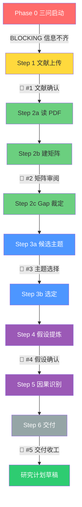

# 选题工坊 v0.3.0

## 📊 流水线一览(图)



> 详见 [`assets/diagram/pipeline.mermaid`](assets/diagram/pipeline.mermaid) 源文件。

## 启动说明(新任务首次响应必须发送)

每次用户首次调用本技能时,先向用户说明以下内容(可调整排版,但不得省略流程与多轮交互提示):

```markdown
本选题工坊是"基于用户文献的可审计选题流程",**以你自己准备的文献为唯一出发点**,不会自动检索文献。

使用流程:
1. 明确你的研究兴趣、当前阶段、研究基础和交付目标(三问启动);
2. 上传你已准备的 PDF / 文献清单;
3. 我会读取你的文献,提炼要点、建矩阵、识别 gap;
4. 从 gap 涌现 3-5 个候选主题,你选 1 个;
5. 我提炼 3-5 个研究假设,你确认;
6. 如需,我给因果识别策略;
7. 交付研究计划草稿 + 后续步骤建议。

本技能**强制 5 次 Checkpoint 硬暂停**(文献确认 → 矩阵审阅 → 主题选择 → 假设确认 → 最终交付),不得跳过、不得代用户自动确认。
另有 Phase 0 三问(信息未齐时 BLOCKING)。请提前准备 PDF / 文献条目(5-50 篇)。
```

发送启动说明后,在同一条回复中继续问**三问启动**(Phase 0)。

---

## 核心理念

**主题不是"想出来"的,是"看出来"的**。
本 skill 强制按 6 步走:**用户上传文献 → 文献综述 → 涌现主题 → 提炼假设 → 因果识别 → 交付**。
每一步都建立在前一步的产出上,禁止跳步。

---

## 三问启动(Phase 0,BLOCKING)

**不要直接进入文献处理**。在读取用户 PDF 之前,先问 3 个问题:

1. **你在关心什么问题?** — 1-2 句话描述研究兴趣 / 现象 / 直觉
2. **为什么是现在?** — 时间约束(硕论 / 博士开题 / 期刊投稿)+ 这个方向是否来得及
3. **你已有什么材料或基础?** — 文献数量 + 是否含综述 + 数据可得性 + 方法偏好

### 三问的推荐问法(可任选一种)

**方式 A · 一次性发问(推荐)**:
```
在开始处理文献之前,先问 3 个问题(每个 1-2 句话即可):

1. 你在关心什么问题?(研究方向 / 现象 / 直觉)
2. 为什么是现在?(时间约束,什么时候要交?)
3. 你已有什么材料?(几篇 PDF?含综述吗?数据可得?)

回答后我开始读你的文献。
```

**方式 B · Grill 机制(分次问)**:
如果用户输入很薄,用 grill-me 风格:一次只问 1 个,等用户回答后再问下一个。每个问题附推荐答案。

### 输入过薄的处置

若用户拒绝回答或输入过薄,**停在 Phase 0,不硬编**。告诉用户:
"需要至少 1 句话的'关心的问题'才能启动。你可以简单说:我在研究 X 方向,想找 Y 类的题目。"

### Phase 0 完成后才进入 Phase 1(文献准备与输入确认)

三问通过后,把用户回答保存为 `00_任务元信息.md`(学科背景 / 当前阶段 / 时间约束 / 交付目标),然后才进入 SKILL.md 的 Step 1。

如果用户已经提供了部分信息(比如模糊领域),跳过三问直接进入 Step 1,但在 Step 1 开头说明"我看到你已提供 X,还需要 Y 才能继续"。

---

## 🎯 使用前必读(用户必做清单)

调用本 skill 前,**用户必须先做 3 件事**:

1. **📥 上传文献**(最重要!)- 把你要研究领域的 PDF 文件(或引用列表)准备好
   - 数量:5-50 篇(太少不够覆盖,太多跑不动)
   - 形式:有 PDF 最佳,纯引用列表也可(质量降一档)
   - 字段:作者、年份、标题、期刊(必备);DOI(强烈建议)
2. **📝 写一句话的模糊领域** — 1-2 句话描述你想研究什么
3. **⚙️ 选方法偏好(可选)** — 你倾向 DID/IV/RDD/实验/质性/混合等

**如果你还没准备好文献**:
- 提示用户先去读 5-10 篇近 3 年的综述(从 CNKI / Google Scholar / Scopus / SSRN 检索)
- 或者直接告诉 skill 你的模糊领域,让 skill 引导你去找文献的方向(但 skill 不会自动检索,只会给"关键词检索式"建议)

---

## 输入契约

调用本 skill 时,用户必须提供:

```yaml
📥 文献清单: "用户自备的 5-50 篇文献"
   - 形式:PDF 文件(有)/ 引用列表(无 PDF 也可)
   - 每条至少含:作者、年份、标题、期刊
   - 强烈建议包含 2-3 篇最近 2 年的综述/meta-analysis
📝 模糊领域: "1-2 句话描述关注的研究领域/现象/直觉"
⚙️ 方法偏好(可选): "用户倾向的识别策略(DID/IV/RDD/实验/质性/混合)"

可选附加:
  - 目标期刊:"AER/QJE/经济研究/管理世界/Social Forces ..."
  - 数据可得性提示:"已掌握 CSMAR/WIND/CHARLS ..."
  - 时长约束:"硕士论文 / 博士开题 / 期刊投稿"
```

**绝对禁止**:本 skill 不得调用任何自动文献检索工具。所有分析必须基于上述输入。

---

## 命令入口(模块化)

Claude Code 的 skill 只有一个 slash 入口:`/选题工坊`。进入后用**自然语言子命令**驱动各模块。

### 默认入口:全流程

```
/选题工坊
然后对 Claude 说:跑全部
```

**入口行为**:
1. **第一件事**:问用户"你的文献准备好了吗?"
   - 如果**没准备好**:给出准备指引(参见 SKILL.md 顶部"使用前必读"),**不进入流水线**
   - 如果**准备好了**:继续
2. 让用户上传文献(PDF 或引用列表)
3. 让用户写模糊领域 + (可选)方法偏好
4. 从 Step 1 一路跑到 Step 6,**强制在 5 个 Checkpoint 各暂停一次**,等用户明确确认后再继续(见下节「强制 5 次 Checkpoint」)

### 子模块独立调用(高级用户)

进入 `/选题工坊` 后,对 Claude 说以下任一说法:

| 说法 | 对应步骤 | 作用 |
|---|---|---|
| "读文献" | Step 2a | PDF 提要点(无 PDF 跳过)|
| "建矩阵" | Step 2b | 结构化文献矩阵 |
| "出gap" | Step 2c | gap 裁定 |
| "出主题" | Step 3 | 涌现候选主题 + 用户选 |
| "出假设" | Step 4 | 提炼研究假设 + 用户确认 |
| "识别策略" | Step 5 | 因果识别(自动检测研究类型后启用/跳过)|

子模块默认读取工作目录里的中间产出文件。如果中间文件不存在,提示用户先跑前置模块。

---

## 6 步流水线

```
Step 1 · 文献准备与输入确认  ← 用户第一个动作是上传文献!
       ↓ 🛑 Checkpoint #1(文献确认) → scripts/check_step.py --step 1
Step 2 · 文献综述       读 + 建矩阵 + 出 gap(3 子步)
       ↓ 🛑 Checkpoint #2(矩阵审阅) → scripts/check_step.py --step 2b
Step 3 · 涌现主题       从 gap 出 3 主推 + 2 备选 → 用户选 1
       ↓ 🛑 Checkpoint #3(主题选择 + Grill 追问) → check_step.py --step 3a
Step 4 · 提炼假设       DAG + 反事实 + 效应量 → 用户确认
       ↓ 🛑 Checkpoint #4(假设确认 + Grill 追问) → check_step.py --step 4
Step 5 · 因果识别       自动检测研究类型,推断性研究才启用
       ↓ 🛑 Checkpoint #5(最终交付审阅) → check_step.py --step 6
Step 6 · 交付物         汇总 + 后续步骤建议
```

## 🎯 Step 3a 输出格式:3 主推 + 2 备选 + topic_scores.json

**3 主推**:从 gap 派生的高价值选题,每个含:
- 来源 Gap
- 研究问题(RQ)
- 理论贡献
- 方法可行性
- 预期效应方向
- **研究类型标签**(推断性 / 描述性 / 质性)
- **降级条件**(什么情况下退到备选)

**2 备选**:降级场景的备选,每个含:
- 来源 Gap
- 研究问题(RQ)
- 理论贡献
- 降级场景(主推不可行时启动)
- 研究类型标签

**topic_scores.json** — 6 维评分(RTS 风格):

| 维度 | 含义 |
|---|---|
| **importance** | 理论 + 实践价值(1-5) |
| **feasibility** | 数据 + 方法可获取性(1-5) |
| **falsifiability** | 能否被推翻(1-5) |
| **evidence_leverage** | 现有文献能支撑多少(1-5) |
| **originality** | 与已有研究的差异度(1-5) |
| **negative_value** | 被推翻后学界仍感兴趣(1-5) |

每个 candidate 的 `decision` 字段:`selected`(主推)/ `parked`(备选)/ `dropped`(淘汰)。`dropped` 必须填 `kill_rule`。

**用户决策**:看 topic_scores.json 的 `total` 分数,选最高的;若主推数据 / 方法不可行,降级到备选(并说明原因)。

**生成方式**:由 `scripts/init_project.py` 创建空模板,skill 跑 Step 3a 时填入 6 维评分。

## 🚦 刚性闸门 + 独立审查

每个 Step 完成后,**必须**通过 `scripts/check_step.py` 校验,才能进入下一步。

```bash
# 初始化项目目录(可选但推荐)
python scripts/init_project.py --workdir <dir> --name "<主题>" --branch "推断性"

# 校验单个 Step
python scripts/check_step.py --workdir <你的工作目录> --step 3a

# 单独校验 topic_scores.json
python scripts/check_step.py --workdir <你的工作目录> --step scores

# 独立审查(scan / topics 阶段必须独立子 agent 跑)
python scripts/review.py --workdir <dir> --target scan   # 生成 review_scan.md 模板
python scripts/check_step.py --workdir <dir> --step scan-review  # 校验 verdict

# 一次性校验全部(含 topic_scores + review)
python scripts/check_step.py --workdir <你的工作目录> --step all
```

**校验规则**:
- `Step 1-6`:每 Step 关键词 + 计数(见 GATES 字典)
- `Step 3a` 额外校验 `topic_scores.json`(6 维评分 + decision)
- `Step 2c 后`:生成 `review_scan.md`,由**独立子 agent**(reviewer ≠ producer)填入 PASS / P0_OPEN / FAIL verdict
- `Step 4 后`:生成 `review_topics.md`,同上独立审查

### 独立审查机制(v0.2.7)

借鉴 RTS v1.5.2 的强制独立审查分离:

```
Step 2c 完成 → 生成 review_scan.md 模板(由 scripts/review.py)
       ↓
调独立子 agent 填 verdict(reviewer context 必须空,不含产出过程)
       ↓
check_step.py --step scan-review 校验 verdict
       ↓
PASS → 进 Step 3 | P0_OPEN → 修后重审(≤3 轮)
```

**信任边界**(诚实声明):verdict 由独立子 agent 填写,理论上审查者也可伪造。完整闭合需受控 runner 外部登记审查行为,超出本 skill 范围(同 RTS v1.5.2 残留)。

## 🛑 强制 5 次 Checkpoint(硬规则,v0.2.9)

**跑全部时必须完整经过 5 次用户确认,缺一不可。**

| # | 时机 | 用户必须给出的最小确认 | 未确认时 |
|---|---|---|---|
| **#1** | Step 1 后 | 明确说「文献/输入确认」或等价肯定 | **停**,不得进 Step 2 |
| **#2** | Step 2b 后 | 明确说「矩阵确认」或等价肯定 | **停**,不得进 Step 2c 主题涌现 |
| **#3** | Step 3a 后 | **点名选 1 个**候选主题(如「选候选 2」) | **停**,不得进 Step 4 |
| **#4** | Step 4 后 | 明确说「假设确认」或逐条确认 | **停**,不得进 Step 5 |
| **#5** | Step 6 后 | 明确说「交付收工」或说明下一步 | **停**,不得宣布流程结束 |

### 硬约束(反跳过)

1. **禁止代选**:Agent 不得写「若无异议我将默认选 Q1 / 默认假设通过」。
2. **禁止合并跳过**:不得把 #1+#2+#3 塞进同一轮「一键全过」;每一闸门单独一轮用户回复。
3. **禁止用闸门脚本代替用户**:`check_step.py` PASS ≠ 用户已确认;脚本通过后仍须等用户口头/点选确认。
4. **Grill 可同闸合并**:同一 Checkpoint 内的 Grill 子问题可放在**同一条消息**里(降低疲劳),但**该闸门整体仍算 1 次硬暂停**,必须等用户对该闸门给出通过/修改意见。
5. **信息已齐也不能砍闸**:即使用户开场已给领域与文献路径,#1–#5 仍须各停一次(可缩短提问文案,不可删除暂停)。
6. **子模块入口**:只跑「出主题」时至少执行 #3;只跑「出假设」时至少 #4;「跑全部」必须 #1–#5 全满。

### 用户侧预期交互次数

- **跑全部 + 强制 5 闸**:**至少 5 轮**用户确认(+ Phase 0 三问若未齐,再 +1 轮或分次)。
- Grill 拉满时子问变多,但仍归入上述 5 次闸门,不另算「可跳过」。

---

## 🛑 Checkpoint 详细设计

每个 Checkpoint 都用 AskUserQuestion(或等价明确提问)追问 + 推荐答案。**通过标准 = 用户明确肯定/做出选择**,不是 Agent 自认合理。

### Checkpoint #1 · 文献确认(Step 1 后) · 强制暂停

向用户展示 `Step1-input.md` 摘要:
- 文献数量、类型分布、时期
- 用户的模糊领域 + 方法偏好(如有)
- 校验是否覆盖(综述 + 实证)

**Grill 追问**(逐项):

1. **文献数量**:"你有 X 篇文献,我建议至少 5-8 篇。**够吗?**"
2. **综述覆盖**:"你目前有 X 篇综述。**综述覆盖是否足够?**"(没有则建议补)
3. **输入完整性**:"你的输入清单如下:[摘要]。**确认无误吗?**"

**通过后才进入 Step 2**。未收到确认前只允许改 Step1-input,不得开读全量矩阵。

### Checkpoint #2 · 矩阵审阅(Step 2b 后) · 强制暂停

向用户展示文献矩阵关键发现:
- 共同主题、共同方法、共同 IV/DV
- 重要 Gap(同质化 / 异质化 / 空白)

**Grill 追问**:

1. **同质化**:"文献高度集中于[IV]→[DV],这正是你想要的聚焦吗?还是希望我重新挑不同方向的?"
2. **方法偏好**:"你之前说偏好[方法],但文献里方法分布是 X/Y/Z,**需要切换吗?**"
3. **数据可得性**:"我看到的样本期是[2010-2022],**数据上你能否覆盖?**"

**通过后才进入 Step 2c → Step 3**。用户要求改方向时,回到 Step 2a/2b 调整后再重新走 #2。

### Checkpoint #3 · 主题选择 + Grill 追问(Step 3a 后) · 强制暂停

向用户展示 3-5 个候选主题。

**Grill 追问**(对每个推荐主题,逐项问):

1. **核心研究问题**:"候选 1 的 RQ 是[...],**这个问题你想研究的吗?**"
2. **理论贡献**:"理论贡献是[...],**这条贡献成立吗?**"
3. **方法可行性**:"方法路径是[...],**你有数据/方法能力吗?**"
4. **预期效应方向**:"预期[+/-/开放],**这符合你的预期吗?**"

**必须**等用户点名选 1 个候选(或明确改写后选定),写入 `Step3b-selected-theme.md` 后才进 Step 4。禁止默认选 total 最高项。

### Checkpoint #4 · 假设确认 + Grill 追问(Step 4 后) · 强制暂停

向用户展示 5 个研究假设。

**Grill 追问**(对每个核心假设,逐项问):

1. **DAG**:"H1 的 DAG 是[X→Y 通过 M1/M2],**这个因果路径合理吗?**"
2. **可证伪条件**:"可证伪条件是[...],**这个条件是否清晰?**"
3. **SESOI**:"SESOI 是[...],**这个效应量你认为实质吗?**"
4. **检验策略**:"检验策略是[...],**你有跑这个方法的能力吗?**"

**必须**等用户确认假设(可要求删改 H),确认后才进 Step 5(推断性)或直接 Step 6(描述性/质性跳过识别)。

### Checkpoint #5 · 最终交付审阅(Step 6 后) · 强制暂停

向用户展示完整 9 个产出文件清单。

**Grill 追问**:

1. **完整性**:"所有 Step 1-6 产出文件是否齐全?"
2. **可投稿性**:"这个研究计划的产出能否直接拿去开题?"
3. **下一步**:"你下一步准备做什么?(跑实证 / 写文献综述 / 找合作者)"

**必须**等用户确认交付清单并说明下一步(或明确「收工」)。未确认前不得说「流程已全部完成」。

---

## Step 1 · 文献准备与输入确认

**这是用户第一个动作!**不是"已经准备好文献",而是"被引导去准备和上传"。

### 动作 1 · 引导用户上传文献

**主调用方**(`/选题工坊` + "跑全部" 入口):
- 第一句话:"📥 请先上传你的文献(5-50 篇 PDF 或引用列表)"
- 如果用户没准备:引导用户去读 5-10 篇近 3 年综述(给关键词检索式建议,但不自动检索)
- 如果用户已上传:继续到动作 2

**子调用方**("建矩阵" 等子模块):
- 检查工作目录是否已有文献文件,没有就报错"请先上传文献"

### 动作 2 · 校验文献质量

- 如果文献 < 5 篇,**要求用户补充**(给"为什么至少要 5 篇"的解释:覆盖性 + gap 派生需要)
- 如果文献 > 50 篇,**主动建议**按主题聚类后分批处理
- 检查文献是否包含最近 2 年的综述;如果没有,提示用户补充(由用户决定)
- 检查字段完整性(作者、年份、标题、期刊必备);缺的字段让用户补,否则留空

### 动作 3 · 确认其他输入

- 让用户写**模糊领域**(1-2 句话);如果用户说"我已经写了",从对话历史读取
- (可选)让用户指定**方法偏好**(DID / IV / RDD / 实验 / 质性 / 混合);不指定用默认推断性

**输出**:`Step1-input.md`(确认后的输入清单,给后续步骤用)。

---

## Step 2 · 文献综述(3 子步)

### Step 2a · 读 PDF 提要点(无 PDF 跳过)

**核心原则**:**直接用 Read 工具读 PDF,读不出来的舍弃并提醒用户,不做 OCR、不调用外部工具**。

**适用条件**:用户提供的文献含 PDF 文件。

**动作**:
1. 对每一篇 PDF,**直接用 Read 工具尝试读**(`Read file_path=xxx.pdf pages=1-N`)
2. 读成功的 → 提取结构化要点(研究问题 / 理论框架 / 数据样本 / 方法 / 主要发现 / 自报局限 / 关联初判)
3. **读不出来的**(扫描版 / 无文字层 / 加密)→ **舍弃该篇 + 提醒用户**:此 PDF 未能提取文字,已跳过。建议手动提取摘要或换可读版本
4. 用户文献全是引用列表(无 PDF) → 跳过此步,Step 2b 直接用用户提供的信息建矩阵

**输出**:`Step2a-points.md`(每篇可读文献 1 张要点卡,约 200-400 字/篇)。

**为什么不做 OCR**:
- 学术用户上传的文献通常本身就可读(不是扫描版)
- OCR 工具(如 MinerU)需要额外 token / 安装 / 配置,门槛太高
- 读不出的文献**通常用户自己也知道**("这篇是扫描的")
- 舍弃比硬挤更有价值——能保证后续分析基于真实可读文本

### Step 2b · 建文献矩阵

**调用**:`literature-matrix-builder`(来自 `claude-academic-skills` skill 库,MIT)

**动作**:把文献汇总成 Excel/CSV 矩阵,字段:

| 作者 | 年份 | 期刊 | 理论 | 样本 | 方法 | IV/DV | 主要发现 | 自报局限 | 与本研究关联 |

**降级路径**:无 PDF 模式下,矩阵的"主要发现"等字段留空,后面可由用户补。

**输出**:`Step2b-literature-matrix.csv`(用户可编辑)。

### Step 2c · 出 gap 裁定(本 skill 自写)

**方法论参考**:JARS / PRISMA 2020 / DA-RT 公开学术标准(参见 `references/methodology-sources.md`)。
**实现原则**:通用语言,不复述任何具体条款。

**动作**:从矩阵中识别 5 类 gap:

1. **已知区**(被多篇充分研究)→ 标记为"避免"
2. **矛盾区**(结论不一致)→ 标记为"高价值 gap"
3. **空白区**(没人做 / 做得不够)→ 标记为"高价值 gap"
4. **方法局限区**(共同方法偏差 / 内生性未充分处理)→ 标记为"中价值 gap"
5. **理论外推区**(某理论在 A 情境成立,B 情境未检验)→ 标记为"高价值 gap"

**关键派生规则**(应对文献同质化):即使文献结论高度一致,**也必须派生**:
- **外推 gap**:在不同样本 / 不同情境 / 用新方法 / 长尾效应下的未知
- **方法 gap**:即使结论一致,共同方法偏差 / 内生性未充分处理也算 gap

每条 gap 必须附:
- 证据来源(具体哪几篇文献)
- 为什么是 gap(不是已被研究)
- 重要性等级(高/中/低)
- 派生依据(以上 5 类中的哪一类)

**输出**:`Step2c-gap-verdicts.md`(约 800-2000 字,通常包含 8-15 条 gap)。

---

## Step 3 · 涌现研究主题

**方法论参考**:brainstorm-then-select 模式(参见 `references/methodology-sources.md`)。

**动作**:从 `Step2c-gap-verdicts.md` 中,选 **3-5 个高/中重要性** 的 gap,各派生 1 个研究主题候选。

每个候选给出:
- **研究问题(RQ)**:1-2 句话,可检验
- **理论贡献**:1-2 句话
- **方法可行性**:1-2 句话
- **预期效应方向**:如果有理论/文献支持,标"预期 +" / "预期 -";否则标"开放"
- **研究类型标签**:**推断性** / **描述性** / **质性**(必填,给 Step 5 用)

**🛑 Checkpoint #3(强制)**:暂停,等用户点名选 1 个,不得自动选、不得默认最高分。

**输出**:
- `Step3a-candidate-themes.md`(3-5 个候选)
- `Step3b-selected-theme.md`(用户选定 1 个)

---

## Step 4 · 提炼研究假设(本 skill 自写)

**方法论参考**:Pearl DAG / VanderWeele 反事实框架 / SESOI 公开学术标准(参见 `references/methodology-sources.md`)。
**实现原则**:通用语言,不复述具体条款。

**动作**:对选定主题,产出 3-5 个**可证伪**的研究假设。

每个假设必须含:
- **假设陈述**(H1, H2, ...)
- **DAG 图(文字描述)**:因 → 果 + 关键混杂变量 + 中介/调节
- **反事实表述**:"如果 [干预] 改变,其他条件不变,[结果] 会 [变化方向/大小]"
- **可证伪条件**:什么观察会让该假设被拒绝
- **最小效应量(SESOI)**:什么大小的效应才有实质意义(基于文献效应量 + 实际显著性)
- **检验策略**:建议的统计方法(DID/IV/RDD/mediation/moderation 等)

**🛑 Checkpoint #4(强制)**:暂停,等用户确认假设,不得自动跑 Step 5。

**输出**:`Step4-hypotheses.md`(含 DAG 文字描述、假设陈述、检验策略)。

---

## Step 5 · 因果识别策略(自动检测研究类型)

**前置判断**:读 Step 3b 的"研究类型标签":
- **推断性**(标签 = 推断性):**启用**本步
- **描述性 / 质性**(标签 = 描述性 / 质性):**跳过**本步,在 `Step6-summary.md` 中说明"研究类型为描述性,不需要因果识别"

**调用**:`causal-inference-architect`(来自 `claude-academic-skills` skill 库,MIT)

**动作**:对每个假设,给出:
- **识别策略**:RCT / 自然实验 / 准实验 / 观察性研究
- **具体方法**:DID / IV / RDD / PSM / SCM / DML ...
- **关键假设检验**:平行趋势 / 外生性 / 连续性 ...
- **工具变量建议**:如果用 IV,给具体 IV 候选
- **稳健性检验清单**:placebo、subsample、alternative IV、样本期截断 ...
- **反例与威胁**:常见的失败模式

**输出**:`Step5-identification-strategy.md`(每个假设 1 段,约 200-400 字)。

---

## Step 6 · 交付物

**动作**:汇总所有产出,给用户一份"研究计划草稿"+ 后续步骤建议。

**交付物清单**:

```
<工作目录>/outputs/
├── Step1-input.md                  确认后的输入
├── Step2a-points.md                文献要点卡(可选)
├── Step2b-literature-matrix.csv    文献矩阵
├── Step2c-gap-verdicts.md          gap 裁定
├── Step3a-candidate-themes.md      候选主题
├── Step3b-selected-theme.md        选定主题
├── Step4-hypotheses.md             研究假设
├── Step5-identification-strategy.md  因果识别(可选)
└── Step6-summary.md                总结 + 后续步骤建议
```

**后续步骤建议**(给用户):
- 进 Stata 实证:用 `stata-mcp` 跑基准回归 + 稳健性
- 进文献精读:用 `bilingual-paper-reader` 复读关键文献
- 进方法精化:用 `causal-inference-architect` 复核识别策略
- 进研究计划书写:把这 6 步产出组装成 5000-8000 字的研究计划文档

**输出**:`Step6-summary.md`(总结 + 后续建议)。

---

## 协议与依赖

- **协议**:MIT(可商用)
- **依赖 skill**(均 MIT,来自 [Nero1688/claude-academic-skills](https://github.com/Nero1688/claude-academic-skills)):
  - `bilingual-paper-reader` — Step 2a 读 PDF
  - `literature-matrix-builder` — Step 2b 建矩阵
  - `causal-inference-architect` — Step 5 因果识别
  - `research-method-selector` — check-ready.sh 环境检查

**依赖安装**(首次使用必做,否则 Step 2/5 会卡):

```bash
git clone --depth 1 https://github.com/Nero1688/claude-academic-skills.git /tmp/cas
for s in bilingual-paper-reader literature-matrix-builder causal-inference-architect research-method-selector; do
  cp -r "/tmp/cas/skills/$s" ~/.claude/skills/
done
# 验证:bash check-ready.sh
```

- **不依赖**:`open-science-skills`(因 CC BY-NC 4.0 非商用冲突)
- **本 skill 自写的步骤**:Step 2c(gap裁定)/ Step 3(主题涌现)/ Step 4(假设提炼)
  - 基于公开学术标准(参见 `references/methodology-sources.md`)
  - 不复制任何受版权保护的 skill 代码或条款原文

---

## 与同族 skill 的分工

| 需求 | 该用 |
|---|---|
| **从用户文献到研究主题 + 假设** | **本 skill(选题工坊)** |
| 自动检索文献 + 综述 | `phd-researcher`(PRISMA/MA 流水线) |
| 复核某假设的因果识别 | `causal-inference-architect`(已在本 skill Step 5 调用) |
| 复核用户已写好综述的引文真伪 | `citation-verifier` / `check-citations` |
| 实证(Stata / R / Python 跑回归) | `stata-mcp` / Stata 流水线 skill |
| 论文写作 / 投稿 | `q1-journal-polisher` / `q1-journal-reviewer` |

---

## 文件结构

```
选题工坊/
├── SKILL.md                              本文件
├── README.md                             安装 + 触发示例
├── LICENSE                               MIT
├── references/
│   └── methodology-sources.md            方法论参考来源(参见用)
├── examples/
│   └── 气候风险对企业绿色转型/            完整跑通案例(9 产出 + 2 审查 verdict + topic_scores)
├── scripts/
│   ├── init_project.py                   初始化工作目录(生成 11 个模板)
│   ├── check_step.py                     刚性闸门校验
│   └── review.py                         独立审查模板生成
└── check-ready.sh                        就绪检查(环境 + 依赖 + 文献目录)
```

---

## TODO(后续迭代)

- [x] 加 `examples/` 子目录,放 1 个完整跑通的例子(v0.2.7 已有:气候风险对企业绿色转型)
- [x] 加 `README.md`,讲清安装和触发示例
- [x] 加 `LICENSE` 文件(MIT)
- [x] 跑 1 个真实社科选题实测,记录每步产出
- [x] 加 `test-prompts.json`,放 2-3 个测试 prompt(v0.2.8: full-pipeline / 文献不足 / 出gap)
- [x] example 补输入端材料(v0.2.8: inputs/00_任务元信息 + literature-list; Step1 与气候案例对齐)
- [ ] 写 1 篇 README 的"30 秒看明白"展示图

---

## 版本

- **v0.1.0**(2026-08-10):初稿。7 步流水线骨架。
- **v0.2.0**(2026-08-10):应用 8 个边界拷问决策。
- **v0.2.1**(2026-08-10):**UX 修复**。
- **v0.2.2**(2026-08-10):**实测驱动修复**。
- **v0.2.3**(2026-08-10):**用户交互增强**。
- **v0.2.4**(2026-08-10):**Checkpoint + Grill 双增**。
- **v0.2.5**(2026-08-10):**3+2 课题选项 + 刚性闸门**。
- **v0.2.6**(2026-08-10):**topic_scores.json + init_project.py**。
- **v0.2.7**(2026-08-10):**独立审查分离 + 安装链路修复**。review.py 独立审查模板;check-ready.sh 去私有路径;命令入口改为合法 slash 语法;依赖安装引导入 README。
- **v0.2.8**(2026-08-10):**P1 复现性**。example 补 inputs/ 输入端;修正 Step1 与气候案例不一致;加 test-prompts.json 3 条固化测试。
- **v0.2.9**(2026-08-10):**强制 5 次 Checkpoint**。#1–#5 全部硬暂停;禁止代选/合并跳过/用 check_step 代替用户确认;修正 Step3/4 闸门编号。
- **v0.2.7**(2026-08-10):**独立审查分离**(借鉴 RTS v1.5.2)。新增 `scripts/review.py` 生成 review_{scan|topics}.md 模板;check_step.py 加 scan-review / topics-review 校验;诚实声明信任边界(verdict 不提供密码学身份保证)。